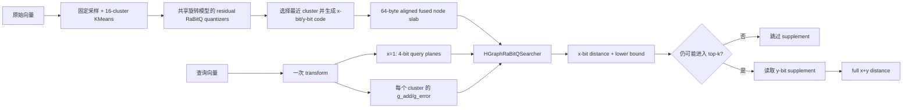

# PR #2596 新增数据结构与算法说明

本文对应
[antgroup/vsag#2596](https://github.com/antgroup/vsag/pull/2596)，代码范围为：

- base：`4625babcf723f8a7da261cfefad9adaa12477123`
- head：`5e81673f1d98a27811e318c470ff2a0838e92ddc`
- 分支：`feat/hgraph-rabitq-fused-x1to4`

本文只统计生产代码中由该 PR 新增的数据结构、状态字段和算法。测试文件中的
`FusedSplitCase`、`EncodedNode` 等 fixture 不计入生产数据结构，但测试覆盖会在文末列出。

## 1. 总体目标与架构

该 PR 为 HGraph 的 RaBitQ split `x+y` 增加一个默认关闭的 fused 路径，支持
`x=1..4`、`y>=1`、`x+y<=8`。核心变化是把底层图邻居和 RaBitQ split 编码放进同一个
64-byte 对齐的 node slab，并使用专用搜索循环直接访问记录。

fused 模式是一次 `Build` 后只读的内存索引。它保留检索、按 ID 距离、内存统计和
Serialize/Deserialize；`Add`、Remove、Update、Merge、Tune、Clone、ExportModel 和
Build Cache 均返回 `UNSUPPORTED_INDEX_OPERATION`。非 fused HGraph 行为不变。



主要接线位置：

- 配置常量：[`include/vsag/constants.h:240`](include/vsag/constants.h#L240)
- 参数映射：
  [`hgraph_param_mapping.cpp:67`](src/algorithm/hgraph/hgraph_param_mapping.cpp#L67)
- 参数校验：
  [`hgraph_parameter.cpp:233`](src/algorithm/hgraph/hgraph_parameter.cpp#L233)
- fused 对象创建与绑定：[`hgraph.cpp:94`](src/algorithm/hgraph/hgraph.cpp#L94)
- 搜索路径选择：
  [`hgraph_search.cpp:676`](src/algorithm/hgraph/hgraph_search.cpp#L676)

## 2. 新增数据结构总表

### 2.1 存储与 codec 边界

| 数据结构 | 代码位置 | 作用 |
| --- | --- | --- |
| `RaBitQFusedCodeView` | [`rabitq_fused_code_storage.h:23`](src/datacell/rabitq_fused_code_storage.h#L23) | 非 owning 的 `{one_bit_code, supplement_code, cluster_id}` 视图。 |
| `RabitQFusedInterface` | [`rabitq_fused_code_storage.h:36`](src/datacell/rabitq_fused_code_storage.h#L36) | 将 split codec 与 fused slab 解耦，提供读、写和预取接口。 |
| `HGraphRaBitQFusedDataCell` | [`hgraph_rabitq_fused_datacell.h:41`](src/datacell/hgraph_rabitq_fused_datacell.h#L41) | 同时实现 `GraphInterface` 和 fused code storage，持有底层 node slab。 |
| `HGraphRaBitQFusedDataCell::NodeView` | [`hgraph_rabitq_fused_datacell.h:44`](src/datacell/hgraph_rabitq_fused_datacell.h#L44) | 一次解引用取得邻居、两段编码和 cluster 信息。 |
| `HGraphRaBitQFusedDataCell::CodeView` | [`hgraph_rabitq_fused_datacell.h:53`](src/datacell/hgraph_rabitq_fused_datacell.h#L53) | 不读取邻居时使用的轻量编码视图。 |
| `fused_wire_layout` | [`hgraph_rabitq_fused_datacell.cpp`](src/datacell/hgraph_rabitq_fused_datacell.cpp) | 反序列化期间承载 wire layout，并逐项验证 offset 和 size。 |

### 2.2 split codec 与查询状态

| 数据结构 | 代码位置 | 作用 |
| --- | --- | --- |
| `RaBitQFusedTraversalQuery` | [`rabitq_split_datacell.h:56`](src/datacell/rabitq_split_datacell.h#L56) | 一次查询的只读热路径状态：变换后查询、query planes、cluster 项、bit 数和误差率。 |
| `RaBitQSplitDataCellInterface` | [`rabitq_split_datacell.h:75`](src/datacell/rabitq_split_datacell.h#L75) | 擦除模板类型，向 HGraph/searcher 暴露 fused 训练、编码、距离和模型导入导出。 |
| `RaBitQSplitDataCell::FusedComputer` | [`rabitq_split_datacell.h:304`](src/datacell/rabitq_split_datacell.h#L304) | 缓存一次查询的 transform、4-bit planes、query 标量和 16 个 cluster 项。 |
| `RaBitQFusedIPPrecision` | [`rabitq_quantizer.h:39`](src/quantization/rabitq_quantization/rabitq_quantizer.h#L39) | 标识 filter inner product 为 `INVALID`、`EXACT` 或 `APPROXIMATE`，防止误用近似 hint。 |

### 2.3 搜索候选与热路径容器

| 数据结构 | 代码位置 | 作用 |
| --- | --- | --- |
| `RaBitQCandidateRecord` | [`distance_heap.h:96`](src/impl/heap/distance_heap.h#L96) | 跨 search/reorder 传递 `{lower_bound, filter_inner_product, id, full_distance}`。 |
| `RaBitQCandidateVector` | [`distance_heap.h:104`](src/impl/heap/distance_heap.h#L104) | `RaBitQCandidateRecord` 的 allocator-aware 容器。 |
| `HGraphRaBitQSearcher` | [`hgraph_rabitq_searcher.h:28`](src/impl/searcher/hgraph_rabitq_searcher.h#L28) | fused HGraph 的上层 route 和底层 direct-search 调度器。 |
| `MaybeSharedLock` | [`hgraph_rabitq_searcher.cpp:35`](src/impl/searcher/hgraph_rabitq_searcher.cpp#L35) | 可选的逐节点共享锁 RAII；避免热循环中的 `shared_ptr` 原子流量。 |
| `search_buffer_record` | [`hgraph_rabitq_searcher.cpp:61`](src/impl/searcher/hgraph_rabitq_searcher.cpp#L61) | beam search 候选的 `{distance, id, checked}` 紧凑记录。 |
| `bounded_result_record` | [`hgraph_rabitq_searcher.cpp:67`](src/impl/searcher/hgraph_rabitq_searcher.cpp#L67) | 16-byte 结果记录；`state` 高位表示已有 full distance，低位保存 candidate index。 |
| `BoundedResults` | [`hgraph_rabitq_searcher.cpp:92`](src/impl/searcher/hgraph_rabitq_searcher.cpp#L92) | 固定容量、有序的 top 结果数组，同时携带 exact filter IP 和 full-distance 状态。 |
| `SearchBuffer` | [`hgraph_rabitq_searcher.cpp:528`](src/impl/searcher/hgraph_rabitq_searcher.cpp#L528) | 从 RaBitQ-Library 移植的有序线性 beam buffer，避免虚函数 heap 操作。 |
| `AffineFilterIP<1..4>` | [`hgraph_rabitq_searcher.cpp:166`](src/impl/searcher/hgraph_rabitq_searcher.cpp#L166) | 按 x-bit 宽度选择近似或精确 inner-product kernel。 |
| `AffineScorer<filter_bits>` | [`hgraph_rabitq_searcher.cpp:262`](src/impl/searcher/hgraph_rabitq_searcher.cpp#L262) | native fused codec 的模板 scorer，统一 estimate、lower bound、hint full 和 direct full。 |
| `LegacyOneBitScorer` | [`hgraph_rabitq_searcher.cpp:403`](src/impl/searcher/hgraph_rabitq_searcher.cpp#L403) | 兼容最初 HNSW-style `1+7` fused codec 的专用 scorer。 |

### 2.4 过滤与新增状态字段

| 数据结构/字段 | 代码位置 | 作用 |
| --- | --- | --- |
| `DuplicateGroupFilter` | [`duplicate_group_filter.h:24`](src/impl/filter/duplicate_group_filter.h#L24) | 只要代表点或任一 alias 通过 filter，就允许遍历该 duplicate group。 |
| `HGraphParameter::rabitq_fused_datacell` | [`hgraph_parameter.h:73`](src/algorithm/hgraph/hgraph_parameter.h#L73) | fused 路径开关，默认 `false`。 |
| `HGraph::rabitq_fused_datacell_` | [`hgraph.h:860`](src/algorithm/hgraph/hgraph.h#L860) | fused bottom graph/slab 实例。 |
| `HGraph::rabitq_fused_searcher_` | [`hgraph.h:861`](src/algorithm/hgraph/hgraph.h#L861) | 专用 fused 搜索器实例。 |
| `InnerSearchParam::rerank_topk` | [`inner_search_param.h:45`](src/impl/inner_search_param.h#L45) | 将最终 rerank 容量与 traversal 的 `ef/topk` 分开。 |
| `InnerSearchParam::rabitq_fused_computer` | [`inner_search_param.h:60`](src/impl/inner_search_param.h#L60) | 上层 route 与 bottom search 共享同一个查询预处理结果。 |
| `QueryContext::enable_rabitq_reorder` | [`query_context.h:65`](src/query_context.h#L65) | 让低层距离函数知道是否必须生成有效 lower bound。 |
| `Computer::auxiliary_*` | [`computer.h:102`](src/quantization/computer.h#L102) | 普通 split 路径缓存 4-bit query planes 及其缩放参数。 |

### 2.5 对既有接口新增的协议入口

这些不是新的 class，但构成 search、codec 和 storage 之间的新协议：

- `FlattenInterface::QueryWithDistanceLowerBoundAndFilterIP`：同时返回 coarse distance、
  lower bound 和可选 exact filter IP；默认实现用 NaN 表示没有 hint。
  位置：[`flatten_interface.h:84`](src/datacell/flatten_interface.h#L84)。
- `FlattenInterface::QueryWithFilterIPHint`：full distance 计算可直接消费 filter IP；默认实现
  回退到普通 `Query`。
  位置：[`flatten_interface.h:110`](src/datacell/flatten_interface.h#L110)。
- `DuplicateTracker::DeserializeBounded`：反序列化时接收 graph capacity 上界。
  位置：[`duplicate_interface.h:54`](src/datacell/duplicate_interface.h#L54)。
- `RaBitQSplitCodeStorage::SkipSerialized`：fused slab 已持有唯一 code 副本时，只校验并跳过
  split storage payload。
  位置：[`rabitq_split_datacell.h:256`](src/datacell/rabitq_split_datacell.h#L256)。

## 3. Fused node slab

### 3.1 记录布局

布局计算位于
[`HGraphRaBitQFusedDataCell` 构造函数](src/datacell/hgraph_rabitq_fused_datacell.cpp#L75)：

| 顺序 | 字段 | 大小/对齐 |
| ---: | --- | --- |
| 1 | `neighbor_count` | `uint32_t`，offset 0 |
| 2 | `neighbors[M]` | 从 offset 4 开始的纯 `InnerIdType` 数组 |
| 3 | `cluster_id` | `uint32_t` |
| 4 | `label` | 按 `alignof(LabelType)` 对齐的 64-bit label |
| 5 | `one_bit_code` | x-bit plane payload 加 filter metadata |
| 6 | `supplement_code` | y-bit payload 加 full metadata |
| 7 | padding | 将整个 `record_size` 补齐到 64-byte 倍数 |

slab 自身额外分配 63 bytes，通过 `aligned_offset_` 保证第一个记录 64-byte 对齐；每个
record 的 stride 也是 64-byte 倍数。实现见
[`Reallocate`](src/datacell/hgraph_rabitq_fused_datacell.cpp#L127)。

该布局带来的直接效果是：取得 node pointer 后，邻居、cluster、x code 和 y supplement
都能以固定 offset 访问，不再通过 graph IO、one-bit IO 和 supplement IO 分别寻址。

### 3.2 纯邻居 ID 与 grow-only 存储

record 不包含 node version，邻居槽也不再编码 version。`InsertNeighborsById` 直接写入
`InnerIdType`。slab 只允许在构建过程中通过 `Resize` 增长；fused datacell 不实现
Delete/Recover、Move 和 ShrinkToFit，也不维护 reverse edges。

### 3.3 分级预取

新增三种预取粒度：

- node header/邻居：
  [`PrefetchNodeHeader`](src/datacell/hgraph_rabitq_fused_datacell.h#L125)
- cluster 与 x-bit filter code：
  [`PrefetchFusedFilter`](src/datacell/hgraph_rabitq_fused_datacell.h#L134)
- y-bit supplement：
  [`PrefetchFusedSupplement`](src/datacell/hgraph_rabitq_fused_datacell.h#L142)

搜索只在 lower bound 仍有竞争力时预取 supplement，从而把较大的 y-bit 访存移出大部分
遍历节点的热路径。

## 4. Fused codec 训练与构建算法

### 4.1 可复现采样和 KMeans

构建流程在 fused 模式下使用固定 seed `0x52425131` 采样训练数据：
[`hgraph_build.cpp:136`](src/algorithm/hgraph/hgraph_build.cpp#L136)。

`KMeansCluster::Run` 新增：

- 可选固定随机种子；
- `deterministic_reduction` 模式；
- 每个任务先写独立的局部 centroid/count buffer，再按稳定顺序归并，避免线程调度改变
  浮点累加顺序。

实现位置：

- API：[`kmeans_cluster.h:39`](src/impl/cluster/kmeans_cluster.h#L39)
- 固定 seed：[`kmeans_cluster.cpp:48`](src/impl/cluster/kmeans_cluster.cpp#L48)
- 确定性归并：[`kmeans_cluster.cpp:117`](src/impl/cluster/kmeans_cluster.cpp#L117)

### 4.2 16-cluster residual codec

[`TrainFusedCodec`](src/datacell/rabitq_split_datacell.h#L1255) 执行：

1. 验证训练向量均为有限数值。
2. 训练最多 16 个 centroid；样本不足时循环复制已有 centroid，仍构造 16 个槽位。
3. 为每个 cluster 创建一个 `RaBitQuantizer`。
4. 通过
   [`ShareFusedModelFrom`](src/quantization/rabitq_quantization/rabitq_quantizer.cpp#L286)
   共享不可变的旋转/变换模型，避免保存 16 份稠密矩阵。
5. 通过
   [`SetCentroid`](src/quantization/rabitq_quantization/rabitq_quantizer.cpp#L271)
   仅替换各 quantizer 的 centroid。

### 4.3 单向量编码

[`EncodeFused`](src/datacell/rabitq_split_datacell.h#L1300) 的步骤是：

1. 选择最近 residual cluster。
2. 用该 cluster 的 quantizer 产生完整 RaBitQ code。
3. 将 full code 拆成 x-bit filter 和 y-bit supplement。
4. `1+7` legacy codec 写入 HNSW-compatible `BinData/ExData` metadata。
5. 其他 `x=1..4` 组合写入新的 affine metadata。

Build 通过
[`sync_fused_node_codes`](src/algorithm/hgraph/hgraph_build.cpp#L615)
把 `{label, cluster_id, x code, y code}` 同步到 node record。

在写入前还会执行两层校验：

- 原始向量有限性：
  [`validate_fused_vector_data`](src/algorithm/hgraph/hgraph_build.cpp#L368)
- 实际试编码：
  [`validate_fused_encoding_data`](src/algorithm/hgraph/hgraph_build.cpp#L385)

## 5. RaBitQ fused 距离算法

### 5.1 查询预处理

[`FactoryFusedComputer`](src/datacell/rabitq_split_datacell.h#L1330) 对每个查询只执行一次：

1. 旋转/变换查询并记录原始 norm、MRQ norm。
2. `x=1` 时量化为 4-bit query，并转置为 bit planes。
3. `x>=2` 时保留变换后的 FP32 查询，供 centered IP kernel 使用。
4. 为 16 个 centroid 预计算 `g_add` 和 `g_error`。

`RaBitQFusedTraversalQuery` 随后只保存指针和标量，供 searcher 热循环读取：
[`GetFusedTraversalQuery`](src/datacell/rabitq_split_datacell.h#L1365)。

### 5.2 4-bit query bit-plane 算法

[`PrepareHnswFourBitQuery`](src/quantization/rabitq_quantization/rabitq_quantizer.cpp#L2372)
将归一化查询线性映射为 4-bit unsigned code，并拆成 4 个 bit plane，同时计算：

- `query_delta`：量化步长；
- `query_vl`：最低值偏置；
- `query_sum`：查询元素和。

遍历时 `RaBitQSQ4UBinaryIPWithBaseSum` 一次返回：

- 低 32 位：4-bit query 与 binary code 的 popcount inner product；
- 高 32 位：binary base code 的 bit sum。

二者组合后得到 `x=1` 的近似 filter IP。该值被标记为 `APPROXIMATE`，不会作为 full
distance 的 exact hint。

### 5.3 native affine metadata

[`EncodeFusedAffineMetadata`](src/quantization/rabitq_quantization/rabitq_quantizer.cpp#L2689)
不改变 bit-plane payload，只覆盖 split record 原有 metadata 区：

- filter metadata：`filter_add`、`filter_rescale`、`filter_error_unit`；
- supplement metadata：`full_add`、`full_rescale`。

filter distance 与 lower bound 为：

```text
filter_distance = filter_add + g_add + filter_rescale * filter_ip
lower_bound = filter_distance - error_rate * filter_error_unit * g_error
```

零 residual 是单独处理的退化情况：`filter_rescale=0`，距离退化为 centroid/residual
常量项，避免除零和 NaN。

### 5.4 x-bit filter scoring

[`ComputeFusedAffineFilter`](src/quantization/rabitq_quantization/rabitq_quantizer.cpp#L2978)
按 x-bit 分流：

| x | filter IP | 精度 | full 阶段能否直接复用 |
| ---: | --- | --- | --- |
| 1 | 4-bit query planes + popcount | approximate | 否，full 时重算 exact 1-bit IP |
| 2 | two-bit centered SIMD | exact | 是 |
| 3 | three-bit centered SIMD | exact | 是 |
| 4 | four-bit centered SIMD | exact | 是 |

searcher 中对应的静态分发位于
[`AffineFilterIP<1..4>`](src/impl/searcher/hgraph_rabitq_searcher.cpp#L166)，避免热循环中的
虚调用或 bit-width 分支。

### 5.5 full x+y distance 与 hint 复用

[`ComputeFusedAffineFullWithFilterIP`](src/quantization/rabitq_quantization/rabitq_quantizer.cpp#L3072)
只扫描 y-bit supplement，然后组合：

```text
full_centered_ip = 2^y * exact_filter_ip
                   + supplement_ip
                   - supplement_center * query_sum
full_distance = full_add + g_add + full_rescale * full_centered_ip
```

因此 `x=2..4` 的 full 阶段不再扫描 x-bit plane。若 exact hint 不存在，则
[`ComputeFusedAffineFullDirect`](src/quantization/rabitq_quantization/rabitq_quantizer.cpp#L3118)
先重新计算 x-bit IP，再进入相同 full 公式。

该 richer-hint 协议只用于 HGraph fused 专用 search/reorder 路径。普通 split HGraph、
Pyramid、`BasicSearcher`、`ParallelSearcher` 和 `ReorderInterface` 继续使用原有
`DistanceRecordVector` 协议。

legacy `1+7` 则使用：

- coarse：[`ComputeHnswOneBit`](src/quantization/rabitq_quantization/rabitq_quantizer.cpp#L2618)
- full：[`ComputeHnswFull`](src/quantization/rabitq_quantization/rabitq_quantizer.cpp#L2658)
- 7-bit compact supplement kernel：
  [`RaBitQFloatExCode7IP`](src/simd/avx2.cpp#L1311)

### 5.6 解码

[`DecodeFusedSplitCode`](src/quantization/rabitq_quantization/rabitq_quantizer.cpp#L2852)
将 x/y plane 合并为 full scalar code，加回 centroid 后执行 inverse rotation。它同时支持
legacy `1+7` compact layout 和 native split-plane layout，供 `GetStats`、导出等非搜索路径使用。

## 6. 专用 HGraph 搜索算法

### 6.1 上层 route

[`HGraphRaBitQSearcher::Route`](src/impl/searcher/hgraph_rabitq_searcher.cpp#L1114)
继续使用 HGraph 的 route graph 拓扑，但距离来自 fused scorer。若 coarse 结果不可用，则回退到
fused full distance；无法评分的 route seed 不会阻断 bottom-layer 搜索。

### 6.2 固定容量容器

`SearchBuffer` 和 `BoundedResults` 都用有序连续数组：

- 二分查找插入位置；
- `memmove` 插入；
- 容量固定为 `ef` 或最终 rerank 容量；
- 无虚函数 heap 调用；
- result record 内联保存 filter IP、candidate index 和 full-distance 状态。

这更适合小到中等 `ef` 的 HNSW/HGraph 热循环，并改善 cache locality。

### 6.3 direct fused traversal

模板热路径入口是
[`search_direct_fused`](src/impl/searcher/hgraph_rabitq_searcher.cpp#L595)，主要步骤为：

1. 对 entry point 评分并插入 beam/result。
2. `Pop` 当前最优未展开节点。
3. 获取一个 `NodeView`，直接遍历 slab 内邻居。
4. 使用 [`VisitedList::TestAndSet`](src/utils/visited_list.h#L58) 合并访问检查与标记。
5. 按 x-bit 宽度批量计算 4 个邻居的 filter distance/lower bound。
6. 对仍可能进入结果集的节点才预取和计算 supplement。
7. 保存 lower bound、exact filter IP，以及已经算出的 full distance。
8. 遵守 filter、attribute executor、timeout、hop limit、reasoning 和逐节点共享锁。

不同 x 使用模板 `AffineScorer<1..4>`，legacy `1+7` 使用 `LegacyOneBitScorer`；运行时只在
进入搜索前做一次 switch：
[`HGraphRaBitQSearcher::Search`](src/impl/searcher/hgraph_rabitq_searcher.cpp#L1211)。

### 6.4 lookahead 与 batch-4

direct path 同时进行两层预取：

- 即将评分的节点：预取 filter code 到 L1；
- 即将展开的 beam candidate：预取 node header/邻居到 L2。

连续四个尚未访问的邻居可进入 batch-4 scorer。这样既摊薄函数调用，又匹配新增的 SIMD
batch kernel。相关循环从
[`search_direct_fused:742`](src/impl/searcher/hgraph_rabitq_searcher.cpp#L742)
开始。

### 6.5 自适应与延迟 rerank

普通模式中，只有以下条件成立才加载 y-bit：

```text
result 未满，或 candidate.lower_bound < 当前最差 full distance
```

当 `ef<=40`、开启 one-bit search 且开启 reorder 时，
[`ShouldDeferRerank`](src/impl/searcher/hgraph_rabitq_searcher.h#L35)
启用延迟 rerank：遍历阶段保留更多 coarse candidates，结束时集中计算必要的 full distance。

已经在遍历中得到的 full distance 会写入 `RaBitQCandidateRecord::full_distance`，后续 reorder
不得重复读取 supplement。

### 6.6 direct path 与 fallback 的边界

HGraph 只有在普通 KNN、无 custom distance、无 duplicate expansion、单搜索线程等条件下才让
fused searcher 直接产出最终结果。判断见
[`hgraph_search.cpp:676`](src/algorithm/hgraph/hgraph_search.cpp#L676)。

range search、iterator、parallel search、duplicate 等路径仍可复用 fused DataCell，但通过
`BasicSearcher`、`ParallelSearcher` 和 `FlattenReorder` 的通用接口完成。

## 7. 候选 hint 与 reorder 算法

### 7.1 候选记录扩展

旧路径只传 `{distance, id}`。新的 `RaBitQCandidateRecord` 同时传递：

- lower bound；
- exact filter IP（仅 x=2..4 有效）；
- full distance（若 traversal 已经计算）；
- ID。

该记录由 `HGraphRaBitQSearcher` 产生，并通过 `FlattenReorder::ReorderFused` 消费；通用
reorder 入口仍接收 `{distance, id}`。

### 7.2 duplicate group 展开

[`DuplicateGroupFilter`](src/impl/filter/duplicate_group_filter.h#L24) 将遍历有效性提升到 group
语义：代表点本身被 filter 拒绝，但任一 alias 有效时，代表点仍可作为图节点被遍历。

结果写入时再逐个检查代表点和 alias；lower-bound candidate 也按 alias 展开，避免漏掉只有
alias 通过 filter 的结果。

### 7.3 `FlattenReorder` 合并与剪枝

入口：[`FlattenReorder::ReorderFused`](src/impl/reorder/flatten_reorder.cpp)。

算法分为以下阶段：

1. 合并 search heap 和 lower-bound candidates；fused 路径按 ID 去重，并保留更优 lower
   bound、可用 exact filter IP 和可用 full distance。
2. 只为没有 traversal hint 的 candidate 补算 lower bound。
3. 若所有 candidate 已有 full distance，直接建 top-k，不再调用 codec。
4. 按 lower bound 升序扫描候选。
5. 已有 full distance 的候选先建立精确 threshold。
6. 当最小未处理 lower bound 已不小于 top-k threshold 时提前终止。
7. 对剩余 candidate 批量计算缺失 full distance；x=2..4 优先调用 exact filter-IP hint
   路径，只读取 supplement。
8. iterator 模式必须把所有 discard candidate 补成 full distance，因为后续分页可能返回它们。

关键实现位置：

- fused hint 去重合并：
  [`flatten_reorder.cpp:256`](src/impl/reorder/flatten_reorder.cpp#L256)
- 全部已有 full distance 的快路径：
  [`flatten_reorder.cpp:378`](src/impl/reorder/flatten_reorder.cpp#L378)
- 缺失 full distance 的批处理：
  [`flatten_reorder.cpp:450`](src/impl/reorder/flatten_reorder.cpp#L450)
- lower-bound 终止条件：
  [`flatten_reorder.cpp:503`](src/impl/reorder/flatten_reorder.cpp#L503)

## 8. 新增 SIMD 算法族

### 8.1 `SQ4U × Binary IP + base sum`

用途：`x=1` 的 4-bit query bit-plane traversal。单次 kernel 同时返回 IP 与 binary base sum。

| 实现 | 单点 | Batch-4 |
| --- | --- | --- |
| generic | [`generic.cpp:969`](src/simd/generic.cpp#L969) | [`generic.cpp:985`](src/simd/generic.cpp#L985) |
| AVX2 | [`avx2.cpp:42`](src/simd/avx2.cpp#L42) | [`avx2.cpp:144`](src/simd/avx2.cpp#L144) |
| AVX512 VPOPCNTDQ | [`avx512vpopcntdq.cpp:24`](src/simd/avx512vpopcntdq.cpp#L24) | [`avx512vpopcntdq.cpp:64`](src/simd/avx512vpopcntdq.cpp#L64) |

AVX2 使用 nibble lookup + `shuffle` 统计 popcount；VPOPCNTDQ 路径直接使用 512-bit
population count。尾部不足一个 SIMD block 时回退到安全的标量/generic 处理。

### 8.2 centered 4-bit IP

用途：`x=4` native affine filter 的 exact centered inner product。

- 模板实现：
  [`rabitq_compute.h:362`](src/simd/kernels/rabitq_compute.h#L362)
- generic：[`generic.cpp:653`](src/simd/generic.cpp#L653)
- AVX2：[`avx2.cpp:1087`](src/simd/avx2.cpp#L1087)
- AVX512：[`avx512.cpp:805`](src/simd/avx512.cpp#L805)

同时新增 Batch-4 版本。`x=2/3` 的 centered kernel 已存在，本 PR 将它们纳入 fused scorer。

### 8.3 compact ExCode7 IP

用途：legacy `1+7` supplement 的紧凑布局。

- generic：[`generic.cpp:867`](src/simd/generic.cpp#L867)
- AVX2：[`avx2.cpp:1311`](src/simd/avx2.cpp#L1311)

当维度不是 64 的倍数或 CPU 不支持专用实现时，安全回退到通用 supplement-plane kernel。

### 8.4 运行时分发

[`rabitq_simd.cpp`](src/simd/rabitq_simd.cpp#L27) 为上述 kernel 新增运行时选择：

```text
VPOPCNTDQ -> AVX2 -> generic
AVX512 -> AVX2 -> generic
```

调用者只使用全局函数指针，不在热循环中重复检测 CPU capability。

## 9. 序列化、恢复与边界校验

### 9.1 单份 fused 序列化

[`HGraphRaBitQFusedDataCell::Serialize`](src/datacell/hgraph_rabitq_fused_datacell.cpp#L440)
依次写入：

1. `GraphInterface` 基础字段；
2. fused wire version；
3. record offsets 和 code sizes；
4. 仅一份 codec model（16 个 centroid）；
5. 连续 node slab。

split DataCell 检测到 external fused storage 后跳过自己的 code payload，避免图、x code、y code
被重复序列化。

### 9.2 防御式反序列化

[`Deserialize`](src/datacell/hgraph_rabitq_fused_datacell.cpp#L460) 在分配内存前验证：

- wire version；
- offset 单调性和字段对齐；
- record stride 为 64-byte 倍数；
- code payload 不越过 record；
- capacity × stride 不溢出；
- codec model 大小精确等于 `16 * dim * sizeof(float)` 加固定头；
- node payload 大小与剩余 stream 边界一致。

`DenseDuplicateTracker` 同时新增 bounded deserialize：
[`dense_duplicate_tracker.cpp:115`](src/datacell/dense_duplicate_tracker.cpp#L115)，防止损坏的
duplicate payload 导致越界分配。

### 9.3 codec 恢复

普通和 streaming deserialize 完成后都调用
[`restore_fused_codec`](src/algorithm/hgraph/hgraph_serialize.cpp#L1089)，检查 graph/base count、
capacity、code size 和 external-storage 绑定，再从 slab 中的单份 model 重建 16 个 quantizer。

legacy v0.14 格式没有 fused block，因此显式拒绝：
[`hgraph_serialize.cpp:380`](src/algorithm/hgraph/hgraph_serialize.cpp#L380)。

## 10. 生命周期和兼容路径

| 生命周期/路径 | 新行为 | 代码位置 |
| --- | --- | --- |
| Build/Train | 训练 16-cluster codec，并在图构建前验证编码 | [`hgraph_build.cpp`](src/algorithm/hgraph/hgraph_build.cpp) |
| Build-time Resize | grow-only 重分配对齐 slab 并保持记录内容 | [`hgraph_rabitq_fused_datacell.cpp`](src/datacell/hgraph_rabitq_fused_datacell.cpp) |
| Mutation APIs | Add/Remove/Update/Merge/Tune/Clone/ExportModel/Cache 均显式拒绝 | [`hgraph.cpp`](src/algorithm/hgraph/hgraph.cpp) |
| GetStats/Decode | 从 fused record 解码，不要求全局 merged code | [`hgraph.cpp:616`](src/algorithm/hgraph/hgraph.cpp#L616) |
| Reorder | 仅当 reorder 使用 base split codes 时注入 fused graph | [`hgraph.cpp:705`](src/algorithm/hgraph/hgraph.cpp#L705) |
| Parallel search | 继续走通用搜索器的 `DistanceRecordVector` 协议 | [`parallel_searcher.cpp`](src/impl/searcher/parallel_searcher.cpp) |

### 10.1 支撑性算法

- [`IsFiniteRaBitQValue`](src/quantization/rabitq_quantization/rabitq_quantizer.h#L31)
  通过 IEEE-754 exponent bits 同时拒绝 NaN 和正负无穷，供 hot path 避免重复的库函数
  分类开销。
- [`sample_train_data`](src/utils/util_functions.cpp#L274) 新增可选 seed，在保持 reservoir
  sampling 行为的同时允许 fused codec 得到可复现样本。
- [`VisitedList::TestAndSet`](src/utils/visited_list.h#L58) 将 tag 初始化、bit 测试和置位合并为
  一次操作，减少 direct traversal 的索引计算和分支。

## 11. 配置约束

`rabitq_fused_datacell=true` 的完整约束集中在：

- 通用参数检查：
  [`hgraph_parameter.cpp:233`](src/algorithm/hgraph/hgraph_parameter.cpp#L233)
- external mapping/metric/graph 检查：
  [`hgraph_param_mapping.cpp:694`](src/algorithm/hgraph/hgraph_param_mapping.cpp#L694)

当前要求：

- HGraph；
- `x in [1,4]`、`y>=1`、`x+y<=8`；
- L2 或 inner product；
- graph、filter code、supplement code 全部使用 memory IO；
- 禁用 MCI、`deduplicate_storage`、remove、reverse edges、force remove 和 PCA；
- 不使用 legacy v0.14 serialization。

默认值为 `false`，因此旧配置、旧 split DataCell 和旧索引仍走原路径。

## 12. 测试与实现映射

| 能力 | 主要测试位置 |
| --- | --- |
| 无 version 的 node layout、纯邻居 ID、grow-only resize、序列化损坏输入 | [`hgraph_rabitq_fused_datacell_test.cpp`](src/datacell/hgraph_rabitq_fused_datacell_test.cpp) |
| route switch、direct/fallback、deferred finalize | [`hgraph_rabitq_searcher_test.cpp:37`](src/impl/searcher/hgraph_rabitq_searcher_test.cpp#L37) |
| residual clusters 与 native bit splits | [`flatten_datacell_test.cpp:229`](src/datacell/flatten_datacell_test.cpp#L229) |
| zero-residual affine metadata | [`flatten_datacell_test.cpp:644`](src/datacell/flatten_datacell_test.cpp#L644) |
| codec-only serialization | [`flatten_datacell_test.cpp:771`](src/datacell/flatten_datacell_test.cpp#L771) |
| duplicate group traversal | [`duplicate_group_filter_test.cpp:47`](src/impl/filter/duplicate_group_filter_test.cpp#L47) |
| SIMD kernel scalar/Batch-4 对照 | [`rabitq_simd_test.cpp`](src/simd/rabitq_simd_test.cpp) |
| 参数接受/拒绝矩阵 | [`hgraph_parameter_test.cpp:723`](src/algorithm/hgraph/hgraph_parameter_test.cpp#L723) |
| full HGraph build/search/serialize/filter | [`test_hgraph_rabitq_split.cpp`](tests/test_hgraph_rabitq_split.cpp) |
| disabled reorder | [`test_hgraph_rabitq_split.cpp:1087`](tests/test_hgraph_rabitq_split.cpp#L1087) |
| full-distance 跨 deferred finalize 复用 | [`test_hgraph_rabitq_split.cpp:1154`](tests/test_hgraph_rabitq_split.cpp#L1154) |
| zero-residual node 无 reorder | [`test_hgraph_rabitq_split.cpp:1234`](tests/test_hgraph_rabitq_split.cpp#L1234) |
| representative 与 aliases 展开 | [`test_hgraph_rabitq_split.cpp:1304`](tests/test_hgraph_rabitq_split.cpp#L1304) |

## 13. 关键不变量

评审该 PR 时，最重要的不变量是：

1. node slab 的 layout 必须与构造参数和序列化 layout 完全一致。
2. cluster ID 必须与 codec model 中固定的 16 个 centroid 对齐。
3. `x=1` 的 4-bit-query filter IP 是近似值，绝不能作为 full-distance exact hint。
4. `x=2..4` 的 filter IP 是精确 centered IP，full 阶段应只读取 supplement。
5. `full_distance` 一旦在 traversal 中有效，后续 reorder 不得重复计算。
6. lower bound 只能用于剪枝，不能作为 iterator 最终返回距离。
7. 非有限输入、metadata 或距离必须显式失败或安全 fallback，不能进入排序容器。
8. fused 开关关闭时，旧存储、旧搜索和旧序列化行为必须保持不变。
