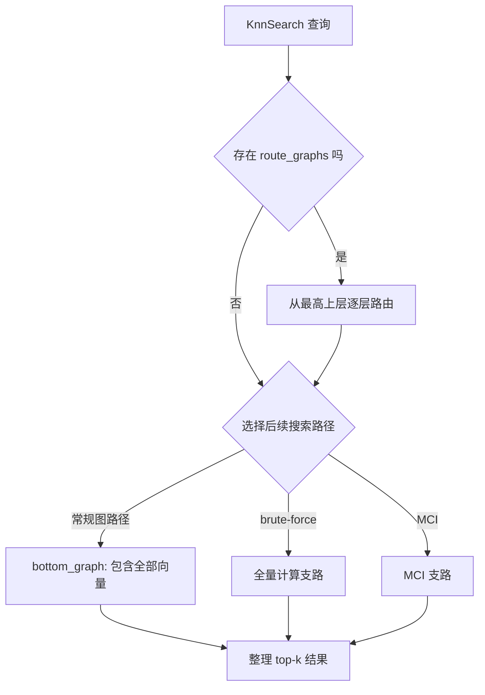
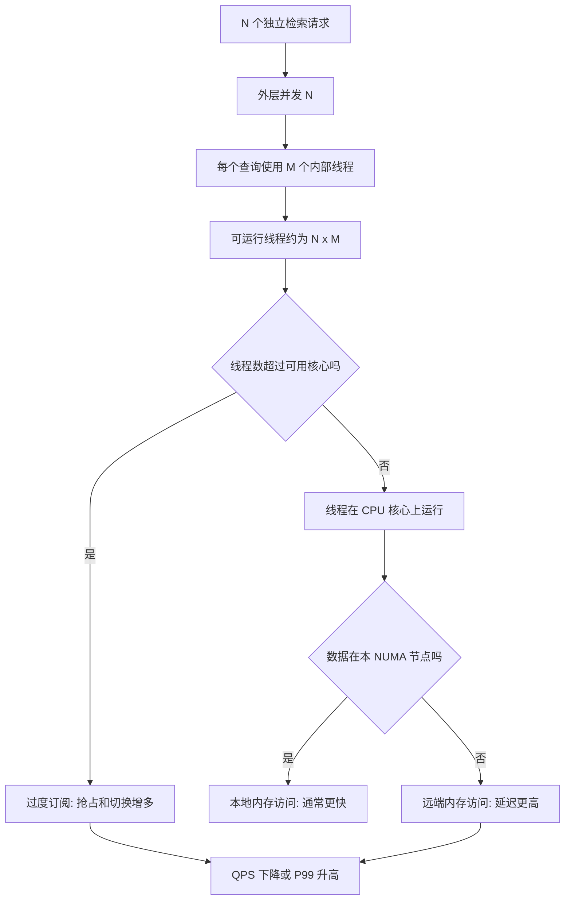
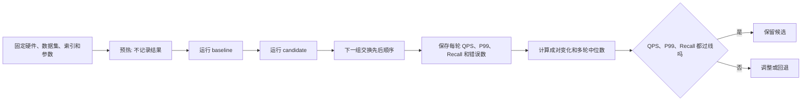

创建日期：2026-08-15
更新日期：2026-08-16

# VSAG 项目申请书概念说明

> 本文用尽量通俗的语言解释项目申请书中的检索、并发、性能分析和实验术语。它是阅读辅助材料，不替代申请书正文。

## 1. 图索引与一次 KNN 检索

**图索引**可以理解为一张“相似向量地图”：每个节点保存一条向量，边连接与它较相似的其他向量。查询时不扫描全部数据，而是从入口节点出发，沿着越来越接近查询向量的邻居前进。


**流程说明：**

1. **KnnSearch**：KNN 是 K Nearest Neighbors，即“找出最相近的 k 个对象”；`KnnSearch` 是 VSAG 接收这类请求的入口。
2. **图遍历**：从入口节点开始查看邻居，并优先向距离查询更近的节点移动。
3. **离散邻居访问**：相邻节点的向量在内存中不一定连续，因此 CPU 可能需要在不同内存位置之间跳转读取。
4. **visited-list**：记录本次查询已经访问过哪些节点，避免重复计算和绕圈。
5. **距离计算**：计算查询向量与候选向量的相似程度，例如欧氏距离或余弦距离。
6. **候选堆**：按距离维护“下一步值得探索的节点”和“当前最好的结果”，堆顶可以快速取出最优或最差候选。
7. **结果整理**：截取 top-k，转换内部编号，并封装成调用者拿到的结果集。

**简单例子：** 假设索引保存 100 万张图片的向量，查询一张猫的图片并设置 `top-k=3`。图索引会从一个入口图片出发，逐步走向更像猫的邻居，最后返回最相似的 3 张图片，而不需要比较全部 100 万条向量。

### 1.1 HGraph 分层结构如何搜索

HGraph 一定有包含全部向量的 `bottom_graph`，还可以有只保留部分节点的稀疏上层 `route_graphs`；小索引或层级抽样结果可能使 `route_graphs` 为空。存在上层图时，它们类似地图中的高速路，先用较少的比较把入口带到查询附近。分层结构描述的是索引如何组织和搜索，不等于指定了唯一的构图算法。



**分层流程说明：**

1. `KnnSearch` 进入 `SearchWithRequest()`，准备查询参数和入口节点。
2. 如果 `route_graphs` 非空，搜索从最高的稀疏上层开始，每层找到一个更靠近查询的节点，并把它作为下一层入口；为空时跳过这一步。
3. 路由结束后根据参数和过滤条件选择后续路径，可能进入 brute-force 或 MCI 支路。
4. 只有常规图搜索路径继续进入 `bottom_graph`，在包含全部向量的图中扩大搜索。
5. 各条路径最终都会整理并返回查询结果。
6. 构图发生在 Build/Add 阶段，不会在每次查询时重新建图。

**构图算法边界：** HGraph 默认 `graph_type="nsw"`，Build 会走 NSW 风格的逐点 Add；只有配置 `graph_type="odescent"` 等非默认路径时，才进入 ODescent 批量构建。ODescent 会迭代更新较近邻居并生成连接边，在该路径中分别构建全量底层图和实际存在的稀疏上层图。

**二维示意：** 假设有 `A=(0,0)`、`B=(1,0)`、`C=(2,0)`、`D=(3,0)`、`E=(8,0)`，查询点为 `query=(1.6,0)`，并求 `top-k=2`。为了便于理解，假设稀疏上层只保留 A、C、E，且有 A-C、C-E 两条边；底层包含 A-E，并把位置相邻的点连接起来。搜索从 A 出发会先移动到更近的 C，下降到底层后再查看 C 附近的 B 和 D。各点到 query 的距离中，C 为 0.4、B 为 0.6，因此示意结果是 C、B。**这只是说明“上层定位、底层细搜”的简化例子，并不代表 NSW 或 ODescent 一定生成这些边，也不复现真实的近似搜索过程。**

源码依据：`src/algorithm/hgraph/hgraph.h:840` 定义 `route_graphs`，`:841` 定义全量 `bottom_graph`；`src/algorithm/hgraph/hgraph_build.cpp:161` 至 `:164` 在默认 NSW 逐点 Add 和可选 ODescent 批量构建之间选择，ODescent 路径的底层 Build 在 `:266`、上层 Build 在 `:274`；`src/algorithm/hgraph/hgraph_search.cpp:419` 是统一搜索入口，`:561` 从最高上层逐层下降，`:656` 是常规图路径进入底层图的位置。用户文档 `docs/docs/zh/src/indexes/hgraph.md:16` 至 `:17` 说明两种算法，`:64` 记录默认值为 `nsw`。

| 关键词 | 一句话解释 |
| --- | --- |
| **HGraph** | VSAG 中基于图进行近似最近邻检索的一类索引实现。 |
| **HGraph KNN** | 使用 HGraph 索引完成“找出最相近 k 个向量”的查询。 |
| **BasicSearcher** | 一次查询主要由当前线程执行的基础搜索器。 |
| **ParallelSearcher** | 一次查询内部再分给多个工作线程计算的搜索器。 |
| **非逃逸临时对象** | 只在当前函数内使用、函数返回后不再被引用的临时对象，适合放在栈上以减少堆分配。 |

源码对应关系：`src/algorithm/hgraph/hgraph_search.cpp:45` 是 KNN 入口，`:269` 选择 Basic/ParallelSearcher，`:540` 获取 visited-list，`:719` 开始整理结果；基础搜索工作区见 `src/impl/searcher/basic_searcher.cpp:553`。

## 2. 多核并发、缓存与 NUMA

申请书中的“请求”专指一次**向量检索查询**。外层并发为 8，表示同一时间有 8 个独立查询在执行。



**关键概念：**

| 关键词 | 通俗解释 |
| --- | --- |
| **外层并发** | 同时执行的独立查询数量，例如并发 16 就是同时处理 16 个搜索请求。 |
| **内部并行** | 一次查询内部再拆给多个线程；VSAG 由 `parallel_search_thread_count` 控制。 |
| **过度订阅** | 可运行线程明显多于 CPU 核心，线程频繁抢占和切换，增加开销而不一定加快搜索。 |
| **CPU/NUMA 拓扑** | CPU 核心、插槽、NUMA 节点和内存之间的组织关系。 |
| **NUMA 节点** | 一台服务器内部的一组 CPU 核心及其更靠近的内存，不是多台服务器。 |
| **多 NUMA 节点** | 同一台多路或大核数服务器中存在多个“核心 + 本地内存”区域。 |
| **本地/远端访存** | CPU 访问本节点内存是本地访存，跨节点读取是远端访存，后者通常更慢。 |
| **CPU affinity** | 把进程或线程固定到指定核心；Linux 可用 `taskset -c 0-15 <命令>`。 |
| **性能 governor** | Linux 的 CPU 频率策略；性能实验常固定为 `performance`，减少动态降频造成的波动。 |
| **OpenMP** | 这里负责外层查询并行；常用 `OMP_NUM_THREADS`、`OMP_PROC_BIND`、`OMP_PLACES` 控制线程数和绑定。 |
| **SIMD** | Single Instruction, Multiple Data，即一条指令同时处理多组数字，适合批量向量距离计算。 |

**NUMA 候选策略：**

- **interleave**：把内存页轮流分布到多个 NUMA 节点，分摊带宽，但单次访问可能跨节点。
- **local allocation**：优先在运行线程所在的 NUMA 节点分配内存，减少远端访问。
- **节点内线程绑定**：把一组线程固定在同一 NUMA 节点的核心上。
- **只读索引副本/查询路由**：每个节点保存只读索引副本，并把查询发给拥有本地副本的线程；代价是增加内存占用。

### 2.1 双 NUMA 节点的具体例子

假设一台服务器有两个 NUMA 节点: node 0 包含 CPU 0-15 和本地内存 0，node 1 包含 CPU 16-31 和本地内存 1。索引页若分配在内存 0，运行在 CPU 4 的查询读取它属于本地访存；运行在 CPU 20 的查询读取同一页则需要经过节点互联，属于远端访存。如果 16 个线程都在 node 1，而索引主要落在 node 0，QPS 就可能受远端延迟和互联带宽影响。这里仍是一台服务器，不是两台服务器组成的集群。

### 2.2 华为云实验机怎么判断

用户截图中的 `ac9.4xlarge.2` 是 **16 vCPU / 32 GiB**。按 aC9 默认每个物理核心提供 2 个硬件线程来理解，它通常相当于 8 个物理核心，适合功能验证和 8/16 并发短测，不适合把 32 路并发解释为 32 个物理核心的正式结果。规格名称和 vCPU 数本身也不能证明虚拟机暴露了几个 NUMA 节点，必须登录机器查看。

**当前实机结论：** `ecs-7eb4` 已实测为 64 个逻辑 CPU、32 个物理核心、1 个 socket、每核心 2 个硬件线程、1 个 NUMA 节点和约 124,628 MiB 可见内存(128 GiB 规格)。CPU 0/1 属于同一物理核心，2/3 属于下一核心，依此类推。因此这台机器已经适合正式执行 1/2/4/8/16/32 并发的 QPS、P99、Recall 验收和通用 CPU core 事件 profiling，无需再租一台同级机器。32 个物理核心的测试可绑定 `0,2,4,...,62`，每个物理核心只取一个逻辑线程，低并发也从这组 CPU 中取相应数量。

这台机器只有 1 个 NUMA 节点，所以它**不能**用于证明跨 NUMA 远端访存优化。实机上的 `perf 6.8.12` 在 root 权限下可读取 `cycles`、`instructions`、`branches` 和通用 cache 事件，但 `perf_event_paranoid=4` 会限制普通用户；当前 `perf list` 未暴露 uncore/IMC 硬件事件，因此也不能据此给出内存控制器带宽结论。对 `sleep 2` 探针看到 `cache-misses=0` 只说明该空负载几乎没有相关工作，不能代表 VSAG 搜索的 cache miss 为零。

如果项目最终只要求固定硬件上的 1-32 并发验收，直接使用当前机器即可。如果导师明确要求验证跨 NUMA 或 uncore 内存带宽，再按需选择确实暴露多个 vNUMA 节点和相应 PMU 事件的更大 ECS 或 BMS(裸金属服务器)；购买前后都要运行探针确认，不承诺某个规格当前有库存或一定暴露这些能力。

**每核心线程数能否设为 1：** 对 aC9 等支持 CPU 选项的规格，购买时可以选择每核心 1 个或 2 个线程。已购实例不能在 Linux 运行中热改，需要先停机(或授权云平台关机)，再通过变更规格设置受支持的 CPU 选项。`taskset` 只选择程序在哪些逻辑 CPU 上运行，不会把 `lscpu` 显示的 `Thread(s) per core` 从 2 改成 1。当前 `ecs-7eb4` 不需要变更规格，测试时从每个物理核心选择一个逻辑 CPU 即可。

```bash
uname -r && lscpu | grep -E 'CPU\(s\)|Core|Socket|Thread|NUMA'
lscpu -e=CPU,CORE,SOCKET,NODE,ONLINE
numactl --hardware
EVAL_PID=12345
numastat -p "$EVAL_PID"
cat /proc/sys/kernel/perf_event_paranoid && perf list | grep -Ei 'uncore|imc|numa'
sudo perf stat -e cycles,instructions,branches,branch-misses,cache-references,cache-misses -- taskset -c "$(seq -s, 0 2 62)" ./build-release/tools/eval/eval_performance my_eval.yaml
```

把 `EVAL_PID` 替换为正在运行的评测进程 PID。`numastat -p` 主要查看该进程的内存页分布在哪些 NUMA 节点及相关统计，不是对每次本地/远端内存访问做精确计数。

官方说明: [aC9 云服务器规格](https://support.huaweicloud.com/productdesc-ecs/zh-cn_topic_0086381982.html)、[CPU 选项设置](https://support.huaweicloud.com/usermanual-ecs/ecs_03_0245.html)、[云服务器网络优化方案（含跨 NUMA 与 taskset 绑核说明）](https://support.huaweicloud.com/ecs_faq/ecs_faq_0037.html)。这些页面用于了解产品能力，实际拓扑和 PMU 可见性仍以上述实机命令为准。

**缓存相关术语：**

- **缓存争用**：多个核心竞争有限的共享缓存容量或带宽，互相挤掉对方的数据。
- **cache line**：CPU 缓存搬运数据的基本块，常见大小为 64 字节。
- **false sharing**：线程修改不同变量，但变量恰好在同一 cache line，导致缓存行在核心间反复传递。
- **padding / 内存对齐**：在变量之间增加空白或调整起始地址，使高频写变量分开落在不同 cache line。
- **热点计数器**：被多个线程高频更新的统计值，例如完成任务数或队列长度。
- **队列游标**：记录队列读写位置的索引；读写线程频繁更新时可能产生 cache line 争用。
- **per-thread 状态**：每个线程独有的计数器、缓冲区或临时状态，避免多个线程写同一份数据。
- **LLC**：Last Level Cache，CPU 访问主内存前的最后一级缓存，通常由多个核心共享。

内部线程选择位置见 `src/algorithm/hgraph/hgraph_search.cpp:285`；ParallelSearcher 创建工作队列与 worker 的位置见 `src/impl/searcher/parallel_searcher.cpp:208`。

## 3. 性能指标与 13.04% 的来源

| 指标 | 含义 |
| --- | --- |
| **QPS** | Queries Per Second，每秒成功完成的向量检索请求数。VSAG 的计算是“成功查询数 / 实际测量时长”。 |
| **P50** | 50% 的查询延迟不超过该值，可理解为典型延迟。 |
| **P99** | 99% 的查询延迟不超过该值，用来观察少数最慢请求。 |
| **Recall** | 近似检索结果与精确真值结果的重合程度，越高表示漏掉的正确近邻越少。 |
| **实际耗时（wall-clock time）** | 从开始到结束真实经过的时间，包含计算、等待、调度等影响；正文宜用“实际耗时”并在首次出现时附英文。 |
| **扩展曲线（scaling curve）** | 横轴是并发度 1/2/4/8/16/32，纵轴是 QPS 或相对单线程的加速比，用来判断增加核心后吞吐是否继续增长。 |
| **RSS** | Resident Set Size，进程当前实际占用的物理内存量。 |

### 3.1 13.04% 怎么算

QPS 与完成一批固定查询所需的时间成反比。目标是 QPS 提升 15%，则新耗时最多为原来的：

`1 / 1.15 = 0.8696`

因此所需的耗时下降比例约为：

`1 - 1 / 1.15 = 13.04%`

例如原来完成一批查询需要 100 秒，QPS 提升 15% 后最多只能用约 86.96 秒，也就是至少节省约 13.04 秒。

### 3.2 “热点占比”和“占比证据”

**热点占比**是某段代码占总耗时的比例。若某阶段只占总耗时 5%，即使把它“完全消除”，理论上也不足以单独支撑 15% 的 QPS 目标。

这里的“完全消除”只是**理论上把该阶段耗时降为零**，用于估算收益上限，并不是说工程上真的能删掉全部工作。

“占比证据”就是先用 `perf`、火焰图或单变量 A/B 说明该路径确实耗时，再实现优化。它与消融实验的思路一致：**每次只改变一个因素，并报告该因素单独贡献了多少收益。**

QPS 的实际计算见 `tools/eval/monitor/latency_monitor.cpp:91`；测量窗口见 `tools/eval/case/search_eval_case.cpp:273`。

## 4. A/B 实验与可复现基线

**A/B 工具**用于在相同条件下比较两个版本：A 是未优化基线，B 是加入一个候选优化的版本。这里比较的是程序性能，不是产品页面的用户分流实验。



**为什么成对交替运行：** 如果每次都先跑 baseline、后跑 candidate，CPU 温度、频率或后台负载可能系统性偏向其中一个版本。`A-B`、`B-A` 交替可以减小这种顺序偏差。

| 关键词 | 通俗解释 |
| --- | --- |
| **baseline** | 未加入本轮优化的对照版本。 |
| **candidate** | 只加入本轮待验证优化的候选版本。 |
| **evaluator** | 负责加载数据、发起检索并输出 QPS/P99/Recall 的评测程序。 |
| **libvsag** | evaluator 实际调用的 VSAG 动态库，里面包含被测搜索实现。 |
| **评测 harness** | 自动准备配置、交替运行 A/B、收集结果并判断是否达标的一组脚本。正文可写成“评测脚本/框架（harness）”。 |
| **共享索引** | baseline 和 candidate 读取同一份已序列化索引，避免两次构建差异干扰比较。 |
| **预热** | 正式计时前先运行一批不计入结果的查询，让代码、数据和线程进入稳定状态。 |
| **pair** | 同一轮、同一并发度下的一次 baseline 与一次 candidate 配对。 |
| **Release 构建** | 开启编译器优化、关闭主要调试开销的正式性能版本。 |
| **动态库** | 运行时加载的 `.so` 文件；这里主要指 `libvsag.so`。 |

### 4.1 为什么检查 realpath、ldd 和 SHA-256

- **realpath**：输出文件的最终规范绝对路径，消除相对路径、`..` 和软链接造成的歧义。它不会打包或复制文件，也不会修改软链接。
- **ldd**：Linux 命令行工具，用来列出一个可执行文件运行时需要的动态库，以及系统实际解析到的库路径。这里重点查看 evaluator 最终加载哪个 `libvsag.so`。
- **SHA-256**：根据文件内容计算指纹。路径不同但指纹相同，说明两个文件的内容仍可能完全相同。

三者分工不同: `realpath` 确认“文件实际在哪里”，`ldd` 确认“程序运行时实际绑定了谁”，SHA-256 确认“两个路径里的内容是否相同”。三项一起检查，才能防止“看似在比较 A/B，实际上两个 evaluator 都加载了同一个 VSAG 库”。

下面是 baseline 的简化检查例子，candidate 需要对自己的独立路径执行同样命令:

```bash
BASE_BIN=/srv/vsag-baseline/build-release/tools/eval/eval_performance
BASE_LIB=/srv/vsag-baseline/build-release/src/libvsag.so.0.0
realpath "$BASE_BIN" "$BASE_LIB"
LD_LIBRARY_PATH="$(dirname "$(realpath "$BASE_LIB")")" ldd "$(realpath "$BASE_BIN")" | grep libvsag
sha256sum "$(realpath "$BASE_BIN")" "$(realpath "$BASE_LIB")"
```

评测脚本从 `tools/eval/run_concurrency_ab.py:333` 开始解析 evaluator 和动态库真实路径，随后运行 `ldd` 并记录 SHA-256；它还会拒绝 baseline 与 candidate 使用相同路径或相同内容。

### 4.2 “重新构建基线”从哪里开始

它不是重写代码，而是在正式服务器上从**未包含候选优化的对照提交**重新编译 baseline 的 evaluator 和 `libvsag`，同时从候选分支编译 candidate。两者使用同一编译器、构建参数、数据集和索引。

申请书中的“构建索引”是把 base 向量加入 VSAG，并生成图结构及序列化索引文件；“构建程序”则是用 CMake/编译器生成 evaluator 和 `libvsag`，两者不要混淆。

### 4.3 20k 合成索引是什么

前期短测使用固定随机种子生成 **20,000 条 32 维 FP32 base 向量**，再由 HGraph 正常构建一个小规模图索引。它只用于检查评测链路和发现趋势，不代表真实业务分布，也不能作为正式验收数据。

A/B 工具的动态库校验见 `tools/eval/run_concurrency_ab.py:333`，指标成对比较见 `:743`，交替顺序见 `:1017`；预热实现见 `tools/eval/case/search_eval_case.cpp:229`。

## 5. Profiling 工具和硬件指标

**Profiling** 是用采样和硬件计数器回答“时间花在哪里、为什么变慢”，而不是只看总 QPS。

`perf` 是 Linux 命令行工具，不是只能手工操作的图形界面。Codex 在拥有本机 shell 或 SSH、目标程序和足够权限时，可以执行命令、保存输出并帮助分析；但它不能绕过云平台或虚拟机对 PMU 硬件计数器的屏蔽，也不能从未暴露的事件推算可靠数据。

### 5.1 perf stat 指标

`perf stat` 在程序结束后给出整次运行的计数汇总。例如:

```bash
sudo perf stat -e cycles,instructions,branches,branch-misses,cache-references,cache-misses -- ./build-release/tools/eval/eval_performance my_eval.yaml
```

| 指标 | 一句话解释 | 常见判断方式 |
| --- | --- | --- |
| `cycles` | CPU 消耗的时钟周期数。 | 同样查询量下越少通常越好。 |
| `instructions` | 执行的机器指令数。 | 判断是否减少了实际工作量。 |
| `IPC` | Instructions Per Cycle，每周期完成多少指令。 | 过低可能表示经常等待内存或分支预测失败。 |
| `branches` | 执行的分支指令数。 | 配合 branch-misses 分析控制流开销。 |
| `branch-misses` | CPU 猜错分支方向的次数。 | 比例高会造成流水线清空。 |
| `cache-references` | 缓存访问次数。 | 与 cache-misses 一起看。 |
| `cache-misses` | 需要去更低层缓存或内存取数据的次数。 | 关注 miss rate，而不是只看绝对次数。 |
| `context-switches` | 操作系统切换正在运行线程的次数。 | 过多常与过度订阅或阻塞有关。 |
| `cpu-migrations` | 线程从一个 CPU 核心迁移到另一个核心的次数。 | 过多可能破坏缓存局部性。 |

**如何证明缓存或 cache line 问题：** 在固定查询量下比较不同并发度或优化前后的 `cache-misses / cache-references`、LLC miss、内存带宽和远端访存比例。如果并发升高时这些指标显著恶化，并且对应 QPS 停滞，才有理由继续做布局或 padding 优化。

### 5.2 perf record/report 与火焰图

`perf record` 定期采样 CPU 正在执行哪个函数，`perf report` 汇总各函数占比；火焰图把调用栈画成宽度图，**越宽表示累计占用 CPU 时间越多**。它可以判断时间主要花在图遍历、距离计算、候选堆、内存分配还是结果封装。

```bash
sudo perf record -F 99 -g -- ./build-release/tools/eval/eval_performance my_eval.yaml
sudo perf report --stdio
```

第一条命令以 99 Hz 采样并记录调用栈，默认写入 `perf.data`；第二条读取该文件并在终端中按函数占比展示结果。生成火焰图时也是从这份采样数据继续转换。

**本机 WSL 状态：** 2026-08-16 复核时，内核是 `6.6.87.2-microsoft-standard-WSL2`。系统存在 `/usr/bin/perf` 包装命令，但缺少与该 Microsoft WSL 内核完全匹配的 `linux-tools`，执行 `perf --version` 或 `perf stat` 都提示 `perf not found for kernel 6.6.87.2-microsoft`。因此当前 WSL 不能提供本项目的 perf 数据，正式 profiling 使用上文已验证可运行通用事件的云服务器。

### 5.3 怎么验证锁争用

1. 用 `perf lock`、锁等待统计或等效采样记录锁的获取次数、等待次数和累计等待时间。
2. 对照源码区分 `shared_mutex`、对象池分片锁和线程池同步。
3. 在同一并发度下比较优化前后锁等待时间、QPS 和 P99。
4. 只有锁等待明显下降且质量指标不回退，才能把收益归因到锁优化。

### 5.4 NUMA 和内存工具

| 工具/指标 | 通俗解释 |
| --- | --- |
| **numactl** | 运行程序时指定使用哪些 NUMA 核心和内存节点，例如固定在节点 0。 |
| **numastat** | 查看进程内存页在各 NUMA 节点的分布及相关统计；它不是精确的逐次访存计数器。 |
| **uncore** | CPU 核心之外的硬件计数器区域，可观测内存控制器、互联和 LLC 等活动。 |
| **Intel PCM / LIKWID** | 读取内存带宽、缓存、NUMA 等硬件指标的工具；能否使用取决于服务器 CPU 和权限。 |
| **远端访存** | CPU 核心跨 NUMA 互联读取其他节点内存。 |
| **LLC 未命中** | 最后一级缓存也找不到数据，需要访问更慢的内存。 |
| **内存带宽饱和** | 内存通道已接近可提供的数据吞吐上限，增加线程也难以继续提高 QPS。 |
| **分配次数** | 查询期间申请内存的次数；高频小分配可能消耗 CPU 并引发分配器争用。 |

工具数据必须与同一轮 QPS、P99 和 Recall 对齐，不能拿不同负载的指标拼接结论。

## 6. 申请书中的优化方案

以下都是**待正式服务器 profiling 验证的候选方案**，不是已经承诺采用的最终实现。

| 候选方案 | 通俗解释 |
| --- | --- |
| **参数解析复用** | 同一线程连续收到相同搜索参数时，复用上次解析好的 JSON，避免重复解析。 |
| **不可变锁快路** | 索引明确进入只读状态后，搜索跳过只为防止并发写入而存在的锁。 |
| **候选堆栈化** | 只在当前函数内使用的候选堆对象放在函数栈上，减少 `new/delete` 和共享指针开销。 |
| **StandardHeap 预留边界** | 创建堆时先预留常用的小容量，减少扩容；同时把初始预留限制在 64 条，避免超大 top-k 立即申请巨量内存。 |
| **工作区复用** | 重复利用临时数组和缓冲区，减少每次查询的内存分配。 |

**候选堆栈化具体改变了什么：** 它不是为了让对象“更早释放”。`candidate_set` 只在 `search_impl()` 内部使用，因此仅把这个堆的外壳对象放到函数栈上，省去一次对象和共享指针控制块的堆分配。需要返回给调用方的 `top_candidates` 仍由 `shared_ptr` 持有，不能一起栈化。两个 `StandardHeap` 内部的 `queue_` 仍通过 VSAG allocator 分配存储，构造时都会预留 64 条记录；因此这项修改没有消除队列内存分配，也没有改变候选顺序。对应代码见 `src/impl/searcher/basic_searcher.cpp:565` 和 `src/impl/heap/standard_heap.cpp:22`。

### 6.1 Mutable、Immutable 与 SetImmutable()

- **Mutable**：索引仍允许 Add/Remove 等修改，搜索必须考虑与写线程并发。
- **Immutable**：索引构建完成后只读，不再修改。
- **SetImmutable()**：不是“设置同步锁”，而是把索引发布为只读状态；HGraph 随后令 Basic/ParallelSearcher 的 `mutex_array` 为空，使搜索走直接读取分支，并用原子变量保证其他线程能看到状态变化。

“生命周期”是指何时允许从可写切换为只读、切换后是否还允许写入；“可见性”是指其他搜索线程是否一定能及时看到已经切换完成。实现位置见 `src/algorithm/hgraph/hgraph.cpp:582`。

典型调用顺序如下，`Add()` 是可选的，但必须发生在只读切换之前:

```cpp
auto index = vsag::Factory::CreateIndex("hgraph", create_params).value();
index->Build(base);
index->Add(incremental_base);
index->SetImmutable();
auto result = index->KnnSearch(query, 10, search_params);

// SetImmutable() 之后不再调用 index->Add(...) 或 index->Remove(...).
```

`SetImmutable()` 先取得 `add_mutex_` 和 `global_mutex_` 的独占锁，让受这些锁保护的写入和搜索跨过清晰的切换边界；随后把搜索器的 `mutex_array` 设为 `nullptr`，最后在 `src/algorithm/hgraph/hgraph.cpp:592` 用 release store 发布 `immutable_=true`。新搜索在 `src/algorithm/hgraph/hgraph_search.cpp:466` 用 acquire load 看到该状态后，不再取得用于协调写入的全局读锁；BasicSearcher 在 `src/impl/searcher/basic_searcher.cpp:52` 检查到空 `mutex_array` 后直接读邻居。

这是**程序协议上的逻辑只读**，不是操作系统把内存页改成只读，也不是给索引再加一把永久锁。公开接口在 `include/vsag/index.h:850` 明确规定切换后不再支持 addition 或 deletion，因此调用者后续不得再执行 Add/Remove；不要把它理解成任意内部写入口都会由 OS 内存保护自动拦截。

### 6.2 避免跨索引污染与 TLS 无界增长

**TLS（thread-local storage）** 是每个线程独有的缓存。若复用工作区时不区分索引 A 和索引 B，可能把 A 的缓冲区错误用于 B，这叫“跨索引污染”。如果线程不断查询不同索引并永久保存所有缓存，内存会只增不减，这叫“TLS 无界增长”。

具体来说，线程池中的 worker W3 可能先执行“查询索引 A”的任务，下一项任务又在同一个 W3 上查询索引 B。TLS 跟随的是 W3 这条执行线程，**不是线程 A 永久绑定索引 A**。如果 TLS 中保存的是依赖 A 的邻居缓冲区，却不检查索引和 allocator，第二项任务就可能错误复用它。

当前 `SearchParameterCache` 不是这种工作区缓存。它只保留该线程最近一次、长度不超过 4096 字节的搜索参数 JSON，并按完整参数字符串判断是否命中；相同 JSON 在索引 A/B 之间复用是安全的，因为解析结果不保存索引指针。参数字符串变化时旧值会被替换，因此它既不缓存邻居数组，也不会为访问过的每个索引各存一份。实现见 `src/utils/search_threshold.h:33`。

如果以后复用真正的搜索工作区，才需要用“allocator + 索引实例 + 图最大度 + 搜索模式”作为缓存 key，并限制可缓存容量；不匹配或超过上限时走普通分配路径，避免跨索引污染和 TLS 无界增长。

### 6.3 并发调度的一个可执行候选

当前只是初步策略，最终阈值由服务器基准决定：

- 当**外层并发接近或超过物理核心数**时，把每次查询的内部线程数固定为 1，避免总线程数远超核心数。
- 当外层并发较低、单次查询工作量较大时，再尝试 2 个或少量内部线程。
- 每种组合都用相同查询量做 paired A/B，以 QPS、P99 和 Recall 共同决定是否保留。

### 6.4 Go / Revise / Stop 是什么

这是每轮候选优化的决策原则：

- **Go（进入下一阶段）**：聚焦测试通过，QPS 有可重复收益，Recall/P99 满足门槛。
- **Revise（调整后重测）**：方向可能正确，但收益不足或波动较大，需要调整方案后重新验证。
- **Stop（停止并回退）**：收益不可重复、适用范围太窄或引入正确性风险，不再保留该候选。

BasicSearcher 的临时堆和工作区见 `src/impl/searcher/basic_searcher.cpp:565`；StandardHeap 的有界预留见 `src/impl/heap/standard_heap.cpp:27`。

## 7. 正确性与并发测试

| 关键词 | 通俗解释 |
| --- | --- |
| **allocator 归属** | 一块内存必须由创建它的分配器释放；若换成另一个 allocator 释放，可能崩溃或破坏内存。 |
| **跨线程引用** | 一个线程仍在使用某对象时，另一个线程修改或释放了它，可能造成数据竞争或悬空引用。 |
| **TSAN** | ThreadSanitizer，运行测试时检测多个线程未正确同步地读写同一内存。 |
| **受控并发测试** | 用屏障、原子标志等方式让多个线程在指定时刻同时执行关键路径，使竞态更容易稳定复现。 |
| **序列化/反序列化** | 把索引保存为字节或文件，再恢复成索引；优化后必须保证恢复出的索引仍能正确搜索。 |

### 7.1 如何验证去锁后的只读路径

测试无法数学上保证“覆盖所有并发时序”，但可以用以下组合显著降低风险：

1. **结果对照**：同一索引、同一查询在 Mutable 和 Immutable 下返回相同 ID 与距离。
2. **公开入口覆盖**：通过公开 `Index::SetImmutable()` 和 `KnnSearch()` 调用，而不只测试内部函数。
3. **并发搜索**：多个线程同时搜索只读索引，重复足够多轮，检查错误、崩溃和结果漂移。
4. **切换边界**：停止写入后调用 `SetImmutable()`，让搜索线程通过同步点开始工作，验证所有线程都看到只读状态。
5. **重复调用**：验证多次调用 `SetImmutable()` 不会破坏状态。
6. **序列化往返**：保存并恢复索引，再执行相同查询并比较结果。
7. **TSAN**：在可承受的测试规模下运行 ThreadSanitizer，补充普通断言看不到的数据竞争检测。

当前 HGraph 已有“并发 Search 过程中切换 Immutable”的受控测试骨架，见 `src/algorithm/hgraph/hgraph_add_test.cpp:1171`；release 发布见 `src/algorithm/hgraph/hgraph.cpp:592`，search acquire 读取见 `src/algorithm/hgraph/hgraph_search.cpp:466`。

## 8. 数据集从哪里来

**SIFT-1M、GloVe-100、NYTimes-256 不是项目题目硬性指定的数据集。** 它们来自 VSAG 仓库已有 benchmark 配置，属于向量检索中常见的公开数据集。选择它们是为了覆盖不同维度、距离类型和数据分布，最终正式数据集仍需与导师确认。

| 数据集 | 数据内容 | 向量与距离 | 用途 |
| --- | --- | --- | --- |
| **SIFT-1M** | 图像局部特征 | 128 维，L2/欧氏距离 | 常用基础 ANN 基准，数据量约 100 万。 |
| **GloVe-100** | 词语的语义向量 | 100 维，余弦距离 | 检查文本语义向量分布下的表现。 |
| **NYTimes-256** | 新闻文章的文本向量 | 256 维，余弦距离 | 检查更高维文本向量下的表现。 |

仓库依据：`benchs/indexes/hgraph-90.yml:36`、`:48`、`:60` 分别提供 HGraph 的 SIFT、GloVe 和 NYTimes 配置；`benchs/README.md:10` 至 `:12` 说明维度和距离类型。

正式申请书中应明确写成“优先使用仓库已有 benchmark 配置覆盖的公开数据集，最终以导师确认为准”，避免让评审误以为这些名称来自项目硬性要求。

## 9. 一句话术语表

| 术语 | 一句话解释 |
| --- | --- |
| 图索引 | 把向量作为节点、相似关系作为边，用沿图前进代替全量扫描。 |
| KNN | 找出与查询最相近的 k 条数据。 |
| HGraph | VSAG 中的一类图索引实现。 |
| QPS | 每秒成功完成的向量搜索请求数。 |
| P99 | 99% 查询都能达到的延迟上界。 |
| Recall | 近似结果找回真实近邻的比例。 |
| 外层并发 | 同时进行的独立查询数量。 |
| 内部并行 | 一次查询内部使用多个工作线程。 |
| NUMA 节点 | 一台服务器内部彼此更靠近的一组 CPU 核心和内存。 |
| 拓扑 | CPU、核心、NUMA 节点和内存之间的组织关系。 |
| SIMD | 一条指令同时处理多组数值。 |
| over-subscription | 线程数超过可用核心太多，即过度订阅。 |
| CPU affinity | 把线程固定到指定 CPU 核心。 |
| governor | Linux 的 CPU 频率策略。 |
| OpenMP | 本项目评测程序用于并行发起查询的线程运行时。 |
| evaluator | 发起查询并记录指标的评测可执行程序。 |
| libvsag | 被 evaluator 调用的 VSAG 动态库。 |
| A/B harness | 自动交替测试 baseline/candidate 并汇总结果的脚本框架。 |
| warmup | 计时前先执行、不计入结果的预热查询。 |
| paired A/B | 同条件下把一次 A 和一次 B 组成一对进行比较。 |
| RSS | 进程实际占用的物理内存。 |
| Profiling | 用采样和计数器定位程序时间花在哪里。 |
| false sharing | 不同线程写不同变量，却因共享同一缓存行而互相干扰。 |
| cache line | CPU 缓存一次搬运和一致性维护的基本数据块。 |
| allocator | 负责申请和释放内存的组件。 |
| TLS | 每个线程独立拥有的存储区域。 |
| TSAN | 检测线程数据竞争的运行时工具。 |
| Mutable / Immutable | 索引仍可修改 / 索引已进入只读状态。 |
| scaling curve | 并发度增加时 QPS 或加速比如何变化的曲线。 |
| hotspot | 占用时间或资源较多、值得优先分析的代码路径。 |
