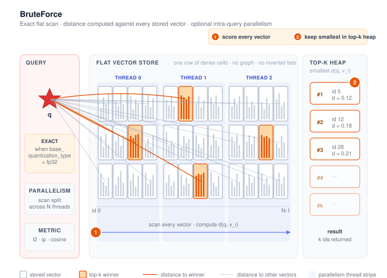

# BruteForce



BruteForce is VSAG's **exact, flat** index. At query time it scores the query against every
vector in the corpus and returns the true top-k — no graph traversal, no inverted lists, no
approximation. Its main role is to be the **ground-truth baseline** that approximate indexes
(HGraph, IVF, …) are evaluated against, but it is also a reasonable production choice for small
corpora or for workloads where 100% recall is mandatory.

- Source: `src/algorithm/bruteforce/bruteforce.{h,cpp}`
- Example: [`examples/cpp/105_index_brute_force.cpp`](https://github.com/antgroup/vsag/blob/main/examples/cpp/105_index_brute_force.cpp)

## How it works

1. **Build.** Vectors are stored in a single flat data cell encoded by `base_quantization_type`
   (default `fp32` — i.e. raw). No graph, no clustering, no training is performed for the
   uncompressed quantizers; PQ/SQ-style quantizers that require training will still run their
   training pass when used.
2. **Add.** New vectors are appended to the flat store. There is no rebalancing or rebuild cost.
3. **Search.** For each query the distance is computed against every stored vector under the
   configured `metric_type` (`l2`, `ip`, or `cosine` for dense vectors; `ip` for sparse vectors),
   then a top-k heap returns the closest ids. Search uses SIMD kernels and supports
   **intra-query parallelism** — a single query can
   be split across multiple threads via the `parallelism` search parameter (see
   `BruteForce::SearchWithRequest` in `src/algorithm/bruteforce/bruteforce.cpp`).

Because the index keeps every vector verbatim (modulo the chosen quantizer), the result is
**exact** when `base_quantization_type` is `fp32` or the input is sparse, and is the standard
reference used to compute ground truth in the `eval_performance` tool.

## Quick start

```cpp
#include <vsag/vsag.h>

std::string params = R"({
    "dtype": "float32",
    "metric_type": "l2",
    "dim": 128
})";
auto index = vsag::Factory::CreateIndex("brute_force", params).value();

// Build.
auto base = vsag::Dataset::Make();
base->NumElements(n)->Dim(128)->Ids(ids)->Float32Vectors(data)->Owner(false);
index->Build(base);

// Search — no index-specific knobs; pass an empty JSON object (or set `parallelism`).
auto query = vsag::Dataset::Make();
query->NumElements(1)->Dim(128)->Float32Vectors(q)->Owner(false);
auto result = index->KnnSearch(query, /*topk=*/10, "{}").value();
```

A full runnable program is at
[`examples/cpp/105_index_brute_force.cpp`](https://github.com/antgroup/vsag/blob/main/examples/cpp/105_index_brute_force.cpp).

## Input data type

BruteForce accepts either dense FP32 vectors (`dtype: "float32"`) or sparse vectors
(`dtype: "sparse"`). Supply dense vectors through `Dataset::Float32Vectors` and sparse vectors
through `Dataset::SparseVectors`. Sparse BruteForce supports only `metric_type: "ip"`; it stores
the original sparse term/value pairs in `SparseVectorDataCell` and reports the exact distance
`1 - inner_product`. A sparse vector may contain at most `dim` entries. Input term order is not
preserved.

Sparse build, add, k-NN search, range search, filters, parallel search, distance-by-id, and
serialization are supported. Sparse `UpdateVector`, raw-vector retrieval, and
`RemoveMode::FORCE_REMOVE` are not supported; use `MARK_REMOVE`.

For dense input, `base_quantization_type` controls the internal encoding and storage, not the
input type. Selecting an internal `fp16`, `bf16`, or other quantizer does not enable FP16/BF16
input. `dtype: "int8"` is not supported.

Minimal sparse configuration:

```json
{
    "dtype": "sparse",
    "metric_type": "ip",
    "dim": 128
}
```

## Build parameters

The minimal config consists of the three top-level fields (`dtype`, `metric_type`, `dim`).
For most uses no `index_param` is needed — that is the form shown in
[example 105](https://github.com/antgroup/vsag/blob/main/examples/cpp/105_index_brute_force.cpp).
Advanced users can pass an `index_param` object to enable quantization or storage tweaks:

| Parameter | Type | Default | Description |
|-----------|------|---------|-------------|
| `base_quantization_type` | string | `"fp32"` (dense), `"sparse"` (sparse) | Dense: `fp32`, `fp16`, `bf16`, `sq8`, `sq4`, `sq8_uniform`, `sq4_uniform`, `pq`, `pqfs`, `rabitq`. Sparse accepts only `sparse`. See the [Quantization chapter](../quantization/) for dense quantizer details. |
| `use_attribute_filter` | bool | `false` | Enable attribute-based filtering (see [Attribute Filter](../advanced/attribute_filter.md)) |
| `resize_increase_count_bit` | int | `10` | `log2` of the slot-growth batch. Valid range is `1` to `31`; `1` grows in 2-slot batches and `10` in 1,024-slot batches. Smaller values reduce preallocation but can increase reallocations. |

> **Note on `store_raw_vector`.** The `store_raw_vector` flag is parsed by the shared
> `InnerIndexParameter` but BruteForce does **not** consult it when deciding whether
> `GetRawVectorByIds` is available. On BruteForce, raw-vector retrieval is enabled strictly
> when `base_quantization_type` is `fp32` and either the metric is not `cosine` or the
> quantizer is configured to hold the per-vector norms (`hold_molds`). Setting
> `store_raw_vector: true` on BruteForce currently has no observable effect on the
> capability flags — use HGraph or IVF if you need a quantized index that still answers
> `GetRawVectorByIds`.

Example with `sq8` quantization for memory savings while keeping linear scan semantics:

```json
{
    "dtype": "float32",
    "metric_type": "ip",
    "dim": 128,
    "index_param": {
        "base_quantization_type": "sq8"
    }
}
```

When `base_quantization_type` is set to a quantizer that requires training (`sq8`,
`sq8_uniform`, `sq4_uniform`, `pq`, `pqfs`, `rabitq`), `Build` will run the training pass on
the supplied dataset before adding vectors; the resulting recall is no longer 100%. Only
`fp32`, `fp16`, and `bf16` skip training and preserve exact distances (modulo numeric
precision).

## Search parameters

BruteForce does not expose any index-specific search knobs (no `ef`, `nprobe`, etc.), but the
generic `IndexSearchParameter` fields are honored:

| Parameter | Type | Default | Description |
|-----------|------|---------|-------------|
| `parallelism` | int | `1` | Split the linear scan of a single query across this many threads in the index's internal thread pool. It applies to both `KnnSearch` and `RangeSearch`. Larger values cut single-query latency on large corpora at the cost of using more cores. Values `<= 0` are clamped to `1`. |

```cpp
// Single-threaded scan (default).
auto r1 = index->KnnSearch(query, topk, "{}").value();

// Use 8 threads to scan a single query in parallel.
auto r2 = index->KnnSearch(query, topk, R"({"parallelism": 8})").value();

// RangeSearch uses the same parallelism parameter.
auto r3 = index->RangeSearch(query, radius, R"({"parallelism": 8})").value();
```

For range search semantics, see [Range Search](../advanced/range_search.md).

## Removing vectors

Dense BruteForce supports both `RemoveMode::MARK_REMOVE` and `RemoveMode::FORCE_REMOVE`; neither
mode needs an HGraph-style `support_force_remove` setting. Sparse and multi-vector BruteForce
support `MARK_REMOVE` only.

For dense BruteForce, enabling `use_attribute_filter: true` disables both removal modes. Sparse
and multi-vector BruteForce still support `MARK_REMOVE`: the tombstone filter is combined with the
attribute filter during search. `FORCE_REMOVE` remains unavailable for these vector types.

- `MARK_REMOVE` is the default. It records a tombstone, so the id is excluded from later searches
  while its vector storage remains allocated. `GetNumElements()` excludes marked ids and
  `GetNumberRemoved()` reports their count.
- `FORCE_REMOVE` physically removes each requested vector. It moves the last internal slot into
  the vacated slot when necessary and keeps the moved vector's external id intact. Successful
  force removals do not add tombstones; pre-existing marked removals remain reflected by
  `GetNumberRemoved()`.

```cpp
index->Remove(std::vector<int64_t>{id1, id2}, vsag::RemoveMode::MARK_REMOVE);
index->Remove(std::vector<int64_t>{id3, id4}, vsag::RemoveMode::FORCE_REMOVE);
```

Physical removal is synchronous and more expensive than marking. It takes the index's exclusive
global lock, so it waits for in-flight searches and prevents new searches while the swap-and-remove
operation runs. Batch ids when possible and avoid force removal on latency-critical paths.

By default, BruteForce uses `block_memory_io` for vector storage. After every successful
force-removal batch, its logical size is reduced to the live entry count and trailing complete blocks
are released; the final partial block remains allocated. The optional extra-information store follows
the same block-granular behavior. To avoid repeated full-table copies, the label table reclaims its
backing allocation when its live entry count falls to at most half of its current capacity.
`GetMemoryUsage()` then reflects the compacted index. This is index allocation accounting,
not a promise that the process allocator
immediately returns memory to the operating system or that RSS drops.

## Capabilities

BruteForce advertises the following capability flags (see `BruteForce::InitFeatures` in
`src/algorithm/bruteforce/bruteforce.cpp`):

| Capability                          | Notes |
|-------------------------------------|-------|
| `SUPPORT_BUILD` / `SUPPORT_ADD_AFTER_BUILD` / `SUPPORT_ADD_CONCURRENT` | Build once, append later, concurrent inserts. |
| `SUPPORT_ADD_FROM_EMPTY` | Available with non-training quantizers (`fp32`, `fp16`, `bf16`). |
| `SUPPORT_KNN_SEARCH` / `SUPPORT_KNN_SEARCH_WITH_ID_FILTER` / `SUPPORT_SEARCH_CONCURRENT` | Standard top-k API and id-list filters, with concurrent search. |
| `SUPPORT_RANGE_SEARCH` / `SUPPORT_RANGE_SEARCH_WITH_ID_FILTER` | Available with non-training quantizers (`fp32`, `fp16`, `bf16`). |
| `SUPPORT_DELETE_BY_ID` / `SUPPORT_DELETE_CONCURRENT` | `Remove` by id is supported. Sparse and multi-vector indexes accept only `MARK_REMOVE`; dense `FORCE_REMOVE` takes an exclusive lock. |
| `SUPPORT_CAL_DISTANCE_BY_ID` | Distance lookup against stored vectors (non-training quantizers only). |
| `SUPPORT_UPDATE_VECTOR_CONCURRENT` | Dense and multi-vector only. For dense FP32 data, `UpdateVector` replaces an existing vector with the same dimension. BruteForce has no graph connectivity check, so `force_update` does not change its update behavior. |
| `SUPPORT_GET_RAW_VECTOR_BY_IDS` | Dense only, when `base_quantization_type` is `fp32` and either the metric is not `cosine` or the underlying quantizer holds molds (`hold_molds`). Sparse and quantized BruteForce indexes do **not** advertise this flag. |
| `SUPPORT_CHECK_ID_EXIST` / `SUPPORT_CLONE` / `SUPPORT_ESTIMATE_MEMORY` / `SUPPORT_GET_MEMORY_USAGE` | Standard introspection and lifecycle. |
| `SUPPORT_SERIALIZE_BINARY_SET` / `SUPPORT_SERIALIZE_FILE` / `SUPPORT_SERIALIZE_WRITE_FUNC` | Full save surface. |
| `SUPPORT_DESERIALIZE_BINARY_SET` / `SUPPORT_DESERIALIZE_FILE` / `SUPPORT_DESERIALIZE_READER_SET` | Full load surface. (There is no `DESERIALIZE_WRITE_FUNC` counterpart — read paths use `READER_SET` instead.) |
| `NEED_TRAIN` | Dense only: set when `base_quantization_type` is one of `sq8`, `sq4`, `sq8_uniform`, `sq4_uniform`, `pq`, `pqfs`, `rabitq`. Sparse storage needs no training. |

Notably **not** supported by BruteForce: `SUPPORT_UPDATE_ID_CONCURRENT` and
`SUPPORT_EXPORT_MODEL`.

## When to use BruteForce

- **Recall baseline.** Compute the ground truth that approximate indexes are scored against
  (this is what the `eval_performance` tool does).
- **Tiny corpora.** A few hundred to a few hundred thousand vectors, where the cost of a full
  scan is acceptable and you want to skip tuning altogether.
- **Strict-recall requirements.** Use cases that cannot tolerate any approximation error.
- **Quantization experiments at small scale.** Reuse the same scan pipeline but compare
  different `base_quantization_type` settings without the confounding effect of a graph or
  inverted-list structure.

For anything larger, prefer [HGraph](hgraph.md) (latency-sensitive, high recall) or
[IVF](ivf.md) (throughput-oriented, memory-friendly).

## See also

- [Creating an Index](../guide/create_index.md)
- [k-Nearest Neighbor Search](../guide/knn_search.md)
- [Range Search](../advanced/range_search.md)
- [Attribute Filter (Hybrid Search)](../advanced/attribute_filter.md)
- [Evaluation Tool](../resources/eval.md)
