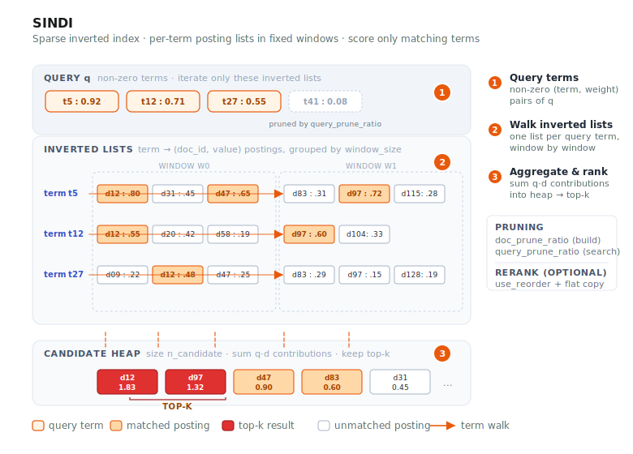

# SINDI



SINDI (**S**parse **IN**verted **D**ense **I**ndex) is VSAG's index for **sparse
vectors** — the kind produced by BM25, SPLADE, and other learned-sparse encoders.
Unlike the dense indexes (HGraph, IVF), SINDI operates directly on term/value
pairs and is the only VSAG index that accepts `dtype: "sparse"`.

- Source: `src/algorithm/sindi/`
- Example: [`examples/cpp/109_index_sindi.cpp`](https://github.com/antgroup/vsag/blob/main/examples/cpp/109_index_sindi.cpp)

## How it works

1. **Window-based inverted lists.** Documents are grouped into fixed-size windows
   (`window_size`). Within each window, an inverted list per term maps a term id
   to the `(doc_id, value)` pairs that mention it.
2. **Optional pruning and quantization.** During construction, `doc_prune_ratio`
   drops low-weight terms per document, and `use_quantization` compresses the term
   values to shrink memory further.
3. **Scoring.** At query time, SINDI iterates the non-zero terms of the query,
   walks the corresponding inverted lists in each window, aggregates contributions
   into a max-heap of size `n_candidate`, and returns the top-k. When `use_reorder`
   is enabled, the candidates are re-scored against a high-precision flat copy.

Distance is returned as `1 - inner_product` so results sort ascending as in the
dense indexes.

## Quick start

```cpp
#include <vsag/vsag.h>

std::string params = R"({
    "dtype": "sparse",
    "metric_type": "ip",
    "dim": 1024,
    "index_param": {
        "term_id_limit": 30000,
        "window_size": 50000,
        "doc_prune_ratio": 0.0,
        "use_quantization": false,
        "use_reorder": false,
        "remap_term_ids": false
    }
})";
auto index = vsag::Factory::CreateIndex("sindi", params).value();

// Build a dataset of SparseVector.
auto base = vsag::Dataset::Make();
base->NumElements(n)
    ->SparseVectors(sparse_vectors)  // vsag::SparseVector*
    ->Ids(ids)
    ->Owner(false);
index->Build(base);

// Search.
auto query = vsag::Dataset::Make();
query->NumElements(1)->SparseVectors(&query_vec)->Owner(false);
auto result = index->KnnSearch(
    query, /*topk=*/10,
    R"({"sindi": {"n_candidate": 100}})").value();
```

## Build parameters

Build-time parameters live under `index_param`. `dtype` **must** be `"sparse"`
and `metric_type` **must** be `"ip"`.

| Parameter | Type | Default | Description |
|-----------|------|---------|-------------|
| `dim` | int | — (required) | Maximum number of non-zero elements per sparse vector. *Not* the vocabulary size. |
| `term_id_limit` | int | `1000000` | Upper bound on term id values (≥ max term id + 1, up to 50 000 000). |
| `window_size` | int | `50000` | Documents per window (range: 10 000 – 60 000). |
| `doc_prune_ratio` | float | `0.0` | Fraction of lowest-weight terms dropped per doc at build time (0.0 – 0.9). |
| `use_quantization` | bool | `false` | Quantize stored term values to cut memory; when enabled, uses 8-bit scalar quantization (SQ8). |
| `use_reorder` | bool | `false` | Keep a high-precision flat copy and rescore results (~2× memory). |
| `remap_term_ids` | bool | `false` | Remap term IDs before indexing; useful when term IDs are sparse or have large gaps. |
| `store_positions` | bool | `false` | Store per-term positions extracted from each document's original token order. Required to use proximity scoring or the phrase filter at query time. Increases memory roughly proportional to document length. |
| `max_positions_per_term` | int | `64` | Cap on stored positions per term per document (range: 1 – 256). Extra occurrences beyond the cap are dropped. Only relevant when `store_positions` is `true`. |
| `avg_doc_term_length` | int | `100` | Hint for memory estimation only. |

> **`dim` vs `term_id_limit`.** For the sparse vector `{0:0.1, 2:0.5, 177:0.8}`,
> `dim` is `3` (three non-zero entries) while `term_id_limit` must be ≥ `178`
> (largest term id + 1). Sizing `term_id_limit` to your vocabulary is the most
> common first-time mistake.

## Search parameters

Search-time parameters live under the `sindi` sub-object:

| Parameter | Type | Default | Description |
|-----------|------|---------|-------------|
| `n_candidate` | int | `0` | Candidate heap size. When `0`, defaults to `SPARSE_AMPLIFICATION_FACTOR · topk` (500×). If set, must satisfy `1 ≤ n_candidate ≤ SPARSE_AMPLIFICATION_FACTOR · topk`. |
| `query_prune_ratio` | float | `0.0` | Fraction of lowest-weight query terms skipped (0.0 – 0.9). |
| `term_prune_ratio` | float | `0.0` | Fraction of term-list entries skipped (0.0 – 0.9). |
| `proximity_boost` | object | — | Proximity-scoring options. Omit this object to use the defaults below. Requires an index built with `store_positions: true` when enabled. |
| `proximity_boost.weight` | float | `0.0` | Weight of the proximity boost. `0.0` disables proximity scoring; a positive value enables it. |
| `proximity_boost.candidates` | int | `10000` | Number of top cosine candidates re-ranked by proximity within each window. Only these candidates pay the proximity cost. |
| `proximity_boost.all_pairs` | bool | `false` | `true` scores all `C(n,2)` query-term pairs; `false` scores only adjacent pairs `(i, i+1)` in query order. |
| `proximity_boost.ordered` | bool | `false` | When `true`, out-of-order (reversed) term pairs are penalized (their distance is doubled), similar to Lucene's slop cost. |
| `proximity_boost.boost_multiplicative` | bool | `true` | `true` multiplies the base cosine score by the proximity boost; `false` adds the boost. |
| `phrase_terms` | int[] | `[]` | Term ids forming a phrase constraint. When non-empty, a candidate is kept only if these terms occur within `phrase_slop`. Requires `store_positions: true`. |
| `phrase_slop` | int | `0` | Maximum allowed slop (edit distance in positions) for the phrase filter. `0` requires an exact, in-order phrase. |

SINDI chooses the heap-insertion strategy automatically from the build-time
`doc_prune_ratio` and search-time `query_prune_ratio`. With the current `0.1`
threshold, SINDI uses the distance-array insertion path when both ratios are
`<= 0.1`; if either ratio is greater than `0.1`, it uses term-list heap
insertion. The legacy
`use_term_lists_heap_insert` search parameter is ignored; configure pruning
ratios instead.

```cpp
auto result = index->KnnSearch(
    query, topk,
    R"({"sindi": {"n_candidate": 200, "query_prune_ratio": 0.1}})").value();
```

## Proximity scoring and phrase filter

By default SINDI scores documents as a bag of words: two documents with the same
term weights score identically regardless of where the terms appear. When term
*position* matters — phrase-like queries, "these words should appear together" —
SINDI can optionally boost documents whose query terms are close, or hard-filter
documents that don't contain a phrase.

Both features require positions to be stored at build time and the original
tokenized document to be supplied per vector.

1. **Build with `store_positions: true`.**
2. **Supply the original token order** on each `SparseVector` via
   `token_sequence_` / `token_seq_len_`. Unlike `ids_` (deduplicated and sorted),
   `token_sequence_` preserves the raw tokenization order and duplicates, which
   is what positions are extracted from.

```cpp
// Build side: enable position storage.
std::string params = R"({
    "dtype": "sparse",
    "metric_type": "ip",
    "dim": 1024,
    "index_param": {
        "term_id_limit": 30000,
        "window_size": 50000,
        "store_positions": true,
        "max_positions_per_term": 64
    }
})";

// Per document: keep the original tokenized term ids.
vsag::SparseVector doc;
doc.len_ = n_nonzero;           // deduplicated ids_/vals_ as usual
doc.ids_ = ids;
doc.vals_ = vals;
doc.token_seq_len_ = seq_len;   // original token order, with duplicates
doc.token_sequence_ = token_ids;
```

**Proximity boost.** Set `proximity_boost.weight > 0` to re-rank the top
`proximity_boost.candidates` within each window (by cosine) using a pairwise
`1/(min_dist + 1)` boost over query terms:

```cpp
auto result = index->KnnSearch(
    query, topk,
    R"({"sindi": {
        "n_candidate": 200,
        "proximity_boost": {
            "weight": 0.3,
            "candidates": 10000,
            "all_pairs": false,
            "ordered": false,
            "boost_multiplicative": true
        }
    }})").value();
```

**Phrase filter.** Set `phrase_terms` (and optionally `phrase_slop`) to keep
only candidates where those terms occur within the given slop. Slop uses
Lucene's normalized-window semantics, so term order is encoded in the offsets
(reversals cost extra slop); `phrase_slop: 0` requires an exact in-order phrase:

```cpp
auto result = index->KnnSearch(
    query, topk,
    R"({"sindi": {
        "n_candidate": 200,
        "phrase_terms": [12, 34, 56],
        "phrase_slop": 1
    }})").value();
```

Proximity and phrase can be combined in the same query. Per-candidate cost is
`O(T² × P)` (T = present query terms, P = positions per term), paid only by the
re-ranked candidates.

## When to use SINDI

- Sparse retrieval with BM25, SPLADE, uniCOIL, or similar learned-sparse encoders.
- Hybrid dense+sparse pipelines where SINDI handles the sparse leg in parallel with
  HGraph / IVF for dense embeddings.
- Memory-constrained deployments of sparse corpora (`use_quantization: true`
  roughly halves memory with a small recall loss; `use_reorder: true` trades
  memory for recall).

SINDI does **not** accept dense vectors and supports only inner-product similarity.
Range search and id-based filtering are supported; see the example for usage.

## Practical guidance

- For Chinese corpora, we recommend encoding sparse vectors with BGE-M3. For
    English corpora, SPLADE is the more common default.
- BGE-M3 can emit both sparse and dense vectors. Today SINDI handles the sparse
    leg, and VSAG plans to support fused sparse+dense scoring in a future release.
- Sparse vectors are not a complete replacement for BM25 full-text retrieval. In
    practice, three-way recall with BM25 + sparse + dense usually outperforms any
    two-way combination.
- At the index level, SINDI can also serve BM25-style scoring: use inverse
    document frequency as the query-side term weight, and use term-frequency-based
    weights as the document-side term value.

## Common configurations

1. Flat brute-force sparse index. Keep all non-zero terms in the inverted index
     (`doc_prune_ratio: 0.0`), disable the flat reranker (`use_reorder: false`),
     and disable quantization (`use_quantization: false`). This is the simplest
     high-recall baseline.
2. Pruned high-accuracy index. Prune most low-weight terms during build
     (`doc_prune_ratio: 0.4`), keep the flat copy for reranking
     (`use_reorder: true`), and enable quantization to shrink inverted-list memory
     (`use_quantization: true`). This is a common balance between memory and
     recall.
3. Very large sparse vocabularies. When term IDs are sparse within the `uint32`
     range, such as hash-based tokenizers, external vocabulary IDs, or vocabularies
     with large gaps, enable `remap_term_ids: true`. This avoids managing many
     empty posting lists and helps stay below the `term_id_limit` ceiling.

## Mark remove

SINDI supports `RemoveMode::MARK_REMOVE`. Calling `Remove(ids)` (the default mode)
tombstones the given ids so they no longer appear in search results;
`GetNumElements()` drops accordingly and `GetNumberRemoved()` reports the running
total. Removing an id that is absent or already removed is a no-op.
`RemoveMode::FORCE_REMOVE` is not supported and returns an error.

Mark-removed documents still occupy memory until the index is rebuilt; the space
is not physically reclaimed.

## See also

- [Creating an Index](../guide/create_index.md)
- [Index Parameters](../resources/index_parameters.md)
- [k-Nearest Neighbor Search](../guide/knn_search.md)
