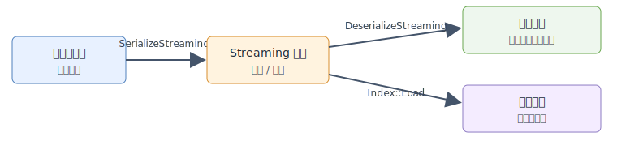

# 新序列化格式

新的序列化格式面向大索引产物和 forward-only 读取场景。它的设计目标是：

- 让文件从头部开始就是自描述的，读取端无需先 seek 到文件尾部，就能识别 magic、版本、metadata 和
  block manifest。
- 将索引内容拆分成带类型的 TLV block，便于工具检查各部分大小，也便于未来 reader 跳过未知的
  non-critical block。
- 为完整恢复（`DeserializeStreaming`）和带策略加载（`Load`）提供统一的流式入口。
- 提供稳定、可检查的布局，便于调试和运维工具进行可视化。

新的序列化格式与之前的 `Serialize`/`Deserialize` 格式**不兼容**。`SerializeStreaming` 写出的文件
必须用 `DeserializeStreaming` 或 `Load` 读取；`Serialize` 写出的文件必须用 `Deserialize` 读取。

## 使用模型

序列化和反序列化是索引产物的存储、传输路径。`SerializeStreaming` 将已经构建好的索引写成自描述文件，
`DeserializeStreaming` 在调用方已经知道要创建哪种索引对象时，恢复完整的内存索引。`Index::Load` 才是
提供搜索服务的加载路径：它从文件 metadata 中创建索引对象，并返回可以直接用于搜索的 `IndexPtr`。



## 流式序列化

`SerializeStreaming`、`DeserializeStreaming` 和 `Load` 读写 forward-only 的索引文件。该格式面向
较大的索引产物：读取端不需要先 seek 到文件尾部解析 footer，就能从文件头拿到格式版本和 block 清单。
当前 BruteForce、HGraph、IVF、SINDI 和 Pyramid 已实现该路径。

```cpp
auto index = vsag::Factory::CreateIndex("hgraph", build_params).value();
index->Build(base).value();

{
    std::ofstream out("hgraph.streaming", std::ios::binary);
    index->SerializeStreaming(out).value();
}

auto restored = vsag::Factory::CreateIndex("hgraph", build_params).value();
{
    std::ifstream in("hgraph.streaming", std::ios::binary);
    restored->DeserializeStreaming(in).value();
}

vsag::IndexPtr loaded;
{
    std::ifstream in("hgraph.streaming", std::ios::binary);
    loaded = vsag::Index::Load(in, "{}").value();
}
```

## Static Load

`Index::Load` 是新 streaming 格式的带策略加载入口。它和 `DeserializeStreaming` 的区别是：调用方不需要
先创建一个空索引对象。`Load` 会先读取 streaming metadata，识别序列化文件中的索引类型和构建参数快照，
在内部创建匹配的索引对象，然后按照 load parameters 加载后续 TLV body blocks。

```cpp
std::ifstream in("hgraph.streaming", std::ios::binary);
auto loaded = vsag::Index::Load(in, R"({"base_io_type":"memory_io"})").value();
```

返回值是可直接使用的 `IndexPtr`，因此它是把索引加载起来并提供搜索服务时优先使用的路径。load
parameters 用来控制支持的 block 加载策略，例如 base codes 使用 memory IO 还是 reader IO。不支持的策略
会返回错误，不会静默 fallback。当前该 API 支持 streaming BruteForce、HGraph、IVF、SINDI 和 Pyramid
索引。其中 BruteForce 支持 block placement 策略，其他已支持索引目前会把写出的 streaming blocks 全部加载到内存。

## 文件布局

流式文件由固定头部和一组 TLV block 构成：

```text
magic("vsagstm0")
format_version
metadata_length
metadata_json
metadata_checksum
block_header + block_payload
block_header + block_payload
...
section_end
```

metadata JSON 中保存索引名称、构建参数快照、基础索引信息和 block manifest。manifest 描述预期的
block tag、block version，以及该 block 是否 critical。未知 critical block 会导致反序列化失败；未知
non-critical block 可以被兼容 reader 跳过。

## BruteForce Blocks

BruteForce 按顺序写入以下 streaming blocks：

| Block | 内容 | 是否必需 |
| --- | --- | --- |
| `attribute_filter` | 开启属性过滤时写入的可选属性过滤索引 | 条件必需 |
| `base_codes` | 暴力搜索使用的 flatten codes | 是 |
| `label_table` | 外部 label 和 label remap | 是 |

`DeserializeStreaming` 会恢复完整的内存 BruteForce 索引。`Load` 当前要求 `base_codes` 加载到内存中；
必需的 BruteForce codes 不支持 reader-based 加载。

## HGraph Blocks

HGraph 按顺序写入以下 streaming blocks：

| Block | 内容 | 是否必需 |
| --- | --- | --- |
| `label_table` | 外部 label、label remap、可选 source id table | 是 |
| `base_codes` | 图搜索使用的 base flatten codes | 是 |
| `bottom_graph` | 覆盖全部向量的底层图 | 是 |
| `high_precision_codes` | reorder 使用独立精排 codes 时的高精度 codes | 条件必需 |
| `route_graphs` | 所有上层 route graph | 是 |
| `extra_info` | 可选 extra info 数据 | 条件必需 |
| `attribute_filter` | 可选属性过滤索引 | 条件必需 |
| `raw_vector` | 可选原始向量存储 | 条件必需 |

`DeserializeStreaming` 会恢复完整的内存索引。`Load` 当前复用同一套 block reader，HGraph block
仍加载到内存中；后续可以在同一个 `Load` 入口后面扩展更细粒度的 reader 或 mmap 加载策略。

## IVF Blocks

IVF 按顺序写入以下 streaming blocks：

| Block | 内容 | 是否必需 |
| --- | --- | --- |
| `ivf_bucket` | 倒排列表使用的 bucket datacell 数据 | 是 |
| `ivf_partition_strategy` | partition strategy 状态，例如已训练的中心点 | 是 |
| `label_table` | 外部 label 和 label remap | 是 |
| `high_precision_codes` | IVF reorder 开启时的 reorder codes | 条件必需 |
| `attribute_filter` | 开启属性过滤时写入的可选属性过滤索引 | 条件必需 |

`DeserializeStreaming` 会恢复完整的内存 IVF 索引。`Index::Load` 可以直接从 streaming metadata
创建 IVF 索引对象，当前会把写出的 IVF blocks 都加载到内存中。

## SINDI Blocks

SINDI 按顺序写入以下 streaming blocks：

| Block | 内容 | 是否必需 |
| --- | --- | --- |
| `sindi_windows` | sparse term windows 和量化运行时状态 | 是 |
| `label_table` | 外部 label 和 label remap | 是 |
| `sindi_rerank_index` | rerank 开启时的可选 rerank flat index | 条件必需 |
| `sindi_term_id_mapper` | 可选 term-id remap 表 | 条件必需 |

`DeserializeStreaming` 会恢复完整的内存 SINDI 索引。`Index::Load` 可以直接从 streaming metadata
创建 SINDI 索引对象，当前会把写出的 SINDI blocks 都加载到内存中。immutable SINDI runtime 暂不支持
该 streaming 序列化路径。

## Pyramid Blocks

Pyramid 按顺序写入以下 streaming blocks：

| Block | 内容 | 是否必需 |
| --- | --- | --- |
| `label_table` | 外部 label 和 label remap | 是 |
| `base_codes` | 图搜索使用的 base flatten codes | 是 |
| `high_precision_codes` | reorder 开启时的精排 codes | 条件必需 |
| `pyramid_hierarchies` | hierarchy 名称和 graph roots | 是 |

`DeserializeStreaming` 会恢复完整的内存 Pyramid 索引。`Index::Load` 可以直接从 streaming metadata
创建 Pyramid 索引对象，当前会把写出的 Pyramid blocks 都加载到内存中。

## 可视化流式索引

构建工具后，传入 streaming index 文件：

```bash
cmake --build build --target visualize_index
build/tools/visualize_index/visualize_index \
  --index_path /tmp/vsag-hgraph-streaming.index \
  --html /tmp/vsag-hgraph-streaming.html
```

CLI 输出包含按真实字节比例展示的 raw horizontal layout，以及高密度的 logical-block layout。HTML
输出会把相关的小 segment 聚合展示，例如 TLV header 与 payload，并在表格中保留精确 segment 明细。

streaming serialization 和 `Index::Load` 的可运行示例见
`examples/cpp/403_persistent_streaming_load.cpp`。
