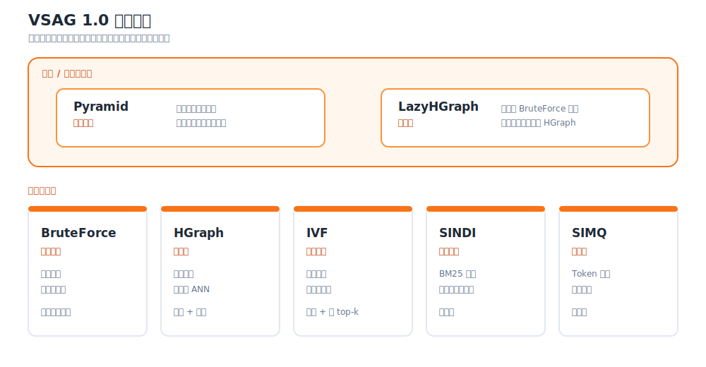

# VSAG 1.0 版本日志

`v1.0.0` 于项目启动三周年当天（2026 年 7 月 12 日）发布。

- [GitHub 官方 Release](https://github.com/antgroup/vsag/releases/tag/v1.0.0)
- [v0.18.0...v1.0.0 完整变更](https://github.com/antgroup/vsag/compare/v0.18.0...v1.0.0)
- 标签对应提交：`efdaf17a10e96cdb5222baf558d50dfacbdc672e`

## 版本概览

VSAG 1.0 是项目首个长期支持（LTS）大版本。截至该版本发布时，
公开的 `0.x` 历史包含从 `v0.11` 到 `v0.18` 的 81 个版本标签。
`v1.0.0` 汇总了这一阶段的主线成果，覆盖稠密向量、稀疏向量、结构化过滤、
层级检索和多向量检索。

`v1.0.0` 官方 Release 收录了 `v0.18.0` 以来的 375 项变化：
48 项新增功能、134 项改进、105 项缺陷修复和 88 项其他变化。
`v0.11.0...v1.0.0` 主线对比包含 1,252 个提交。

本文以 `v1.0.0` 标签的最终状态为准，不列出开发期间曾加入、
但在正式发布前移除的中间功能。

## 主要能力

### 索引体系

下图按职责展示 VSAG 1.0 的索引体系：Pyramid 和 LazyHGraph 提供组合与自适应能力，
BruteForce、HGraph、IVF、SINDI 和 SIMQ 覆盖五类核心检索。

组合与自适应索引：

- **Pyramid** 按路径分区，面向多租户与层级检索。VSAG 1.0 新增
  [命名层级的构建、增量写入与检索](https://github.com/antgroup/vsag/pull/2226)。
- **LazyHGraph** 是自适应稠密向量索引，在小规模阶段使用 BruteForce 精确检索，
  数据量达到可配置阈值后转换为 HGraph，适合持续增长的集合
  （[PR #2151](https://github.com/antgroup/vsag/pull/2151)）。

核心索引族：

- **BruteForce** 同时支持单向量和多向量检索，是精确检索基线，
  也适合直接检索小规模数据集。
- **HGraph** 面向高召回、低延迟的稠密向量检索。从最初的
  [HGraph 实现](https://github.com/antgroup/vsag/pull/114)发展至今，已支持量化、过滤、
  范围与迭代检索、更新、标记/强制删除、缓存导入导出、诊断和内存+磁盘配置。
- **IVF** 通过空间划分服务大规模数据、批量查询和大 `top-k` 场景，支持量化、
  重排、属性过滤、并行构建/检索和磁盘分桶存储。参见最初的
  [IVF PR](https://github.com/antgroup/vsag/pull/505)。
- **SINDI** 面向 BM25 风格和学习型稀疏表示。1.0 系列新增词项 ID 重映射、
  分析、不可变读取、稀疏 FP16 值、稀疏词项列表压缩，以及
  [低内存不可变构建](https://github.com/antgroup/vsag/pull/2424)。
- **SIMQ** 面向 ColBERT 等 late-interaction 多向量检索，先在聚类级别生成候选，
  再用精确 MaxSim 重排，以平衡召回率和延迟
  （[PR #2357](https://github.com/antgroup/vsag/pull/2357)）。

各索引的参数与使用说明参见[索引](../../indexes/)。

### 量化、数据类型与硬件加速

`0.x` 系列围绕内存占用、精度和性能建立了多条量化与加速路径。
VSAG 1.0 的主要能力包括：

- FP32、INT8、FP16、BF16 稠密输入，以及稀疏与多向量数据集；其中 FP16/BF16
  直接输入由 [PR #1731](https://github.com/antgroup/vsag/pull/1731)引入；
- SQ4/SQ8 及对应的均匀量化变体；
- Product Quantization 和 PQ FastScan，分别由
  [PR #626](https://github.com/antgroup/vsag/pull/626)和
  [PR #691](https://github.com/antgroup/vsag/pull/691)引入；
- RaBitQ、扩展位宽与 x+y split 的基础/重排布局、FHT/PCA 变换和专用 SIMD 内核；
- Transform Quantizer 链与 MRL-E 降维；
- x86_64 上的 SSE、AVX、AVX2、AVX-512 和部分 AMX 内核，以及 ARM NEON、SVE；
- SQ8U 内积和 KMeans BF16 GEMM 的 AMX 加速
  （[PR #2032](https://github.com/antgroup/vsag/pull/2032)）。

支持组合与调参建议参见[量化](../../quantization/)。

### 检索 API、过滤、生命周期与可观测性

- `KnnSearch`、`RangeSearch` 继续服务简单场景；复杂场景可使用 `SearchRequest` 和
  `Index::SearchWithRequest`，在一个请求对象中描述 KNN/range 模式、JSON 参数、
  `FilterPtr`/bitset/属性过滤和 reasoning 输入。可用字段与模式取决于具体索引。
- SQL 风格属性表达式与属性倒排索引支持 HGraph、IVF、BruteForce
  的结构化过滤；HGraph 还支持迭代过滤。配置 `hgraph.brute_force_threshold` 后，
  HGraph 可在过滤选择率极低时回退到暴力检索。
- 索引生命周期能力扩展到 `Train`、`Clone`、`ExportModel`、`Tune`、批量删除、
  标记/强制删除、更新、Source ID、详情读取和内存估算；实际支持范围以索引的
  `IndexFeature` 声明为准。
- `SearchRequest::expected_labels_` 可在 HGraph、IVF 和 BruteForce 中启用漏召回分析，
  推理报告随结果 `Dataset` 返回
  （[PR #1838](https://github.com/antgroup/vsag/pull/1838)）。
- 检索、I/O、内存和索引专用统计，以及 `extra_info`、索引内省、
  `CalcDistanceById`（兼容保留旧名 `CalDistanceById`）和分析工具，
  为应用提供可编程的索引状态与诊断信息。

### 存储、I/O、序列化与兼容性

v0.x 版本建立了 DataCell 与 I/O 抽象、多种存储后端、磁盘 IVF，以及 HGraph 的
内存+磁盘配置。VSAG 1.0 进一步引入头部先行（header-first）、仅需顺序读取的
[流式序列化格式](https://github.com/antgroup/vsag/pull/2256)：

- `SerializeStreaming` 先写元数据，再写带类型的 TLV 数据块；
- `DeserializeStreaming` 将数据恢复到已创建、为空且兼容的索引对象；
- `Index::Load` 读取元数据、创建对应索引，并应用受支持的存储放置策略；
- BruteForce、HGraph、IVF、可变 SINDI 和 Pyramid 已支持 v1.0 流式序列化；
  不可变 SINDI 运行态在 v1.0 中暂不支持。

新流式格式与既有 `Serialize`/`Deserialize` 格式**不兼容**。两套 API 均会保留，
但文件必须使用对应的接口读取。格式和数据块版本细节参见
[新序列化格式](../../advanced/new_serialization.md)。

新接入建议优先使用流式序列化接口。

跨版本索引测试样本和[兼容性检查工具](../check_compatibility.md)
可用于重复验证旧索引的升级过程。

### 平台、绑定与工具

- macOS 新增[构建支持](https://github.com/antgroup/vsag/pull/1439)、LLVM 15
  [格式化与静态检查支持](https://github.com/antgroup/vsag/pull/1906)，以及
  [PR CI](https://github.com/antgroup/vsag/pull/1930)。Linux x86_64 与 AArch64
  均通过 CI 和 Python wheel 工作流验证；实际产物因绑定和架构而异。
- Python 构建迁移到原生 CMake 集成，并支持 Python 3.13/3.14
  （[PR #1599](https://github.com/antgroup/vsag/pull/1599)）。`pyvsag` 还扩展了
  索引操作、FP16/BF16 输入、稀疏向量和稀疏 HDF5 辅助工具。
- VSAG 新增 C API 与
  [Node.js/TypeScript 绑定](https://github.com/antgroup/vsag/pull/1812)，并提供
  快速入门示例。绑定包的版本与分发渠道需独立于 C++ 核心标签确认。
- 构建与分发支持系统级 OpenBLAS/fmt、自定义依赖下载镜像、可安装的 CMake 包配置，
  以及内含依赖的发布产物。
- `eval_performance` 支持稠密、稀疏和多向量数据集；`analyze_index`、
  `check_compatibility`、`visualize_index` 和 HTTP 监控服务补齐了分析、兼容性验证、
  序列化检查与监控工具。

### 稳定性与验证

v1.0 的缺陷修复覆盖并发检索、更新与删除，以及异常安全、内存泄漏、
整数溢出、越界访问、I/O 资源清理、序列化状态、量化边界、确定性过滤和平台构建。

工程侧还扩展了 ASan/TSan、兼容性测试样本、单测覆盖率和可复现测试数据，
并完善公共头文件自包含、单向依赖的源码分层及按变更范围触发的 CI。

## 从 v0.18 升级的兼容性说明

VSAG 1.0 是大版本升级，包含源码级 API 变化。升级前请重点检查：

1. **`Remove` 返回删除数量并支持批量操作。** v0.18 的
   `tl::expected<bool, Error> Remove(int64_t)` 调整为
   `tl::expected<uint32_t, Error>`，并增加批量重载和显式删除模式
   （[PR #1551](https://github.com/antgroup/vsag/pull/1551)）。
   v1.0 最终提供 `RemoveMode::MARK_REMOVE` 和 `RemoveMode::FORCE_REMOVE`；
   HGraph 强制删除由
   [PR #1810](https://github.com/antgroup/vsag/pull/1810)实现。
2. **不支持的操作通常改为返回错误。**
   许多返回 `tl::expected` 的默认方法不再抛出
   `std::runtime_error`，而是返回带
   `ErrorType::UNSUPPORTED_INDEX_OPERATION` 的 `tl::unexpected`
   （[PR #2141](https://github.com/antgroup/vsag/pull/2141)）。调用 `.value()` 前
   应先检查 `tl::expected` 返回值。
3. **内存统计接口签名发生变化。** `GetMemoryUsage` 使用 `uint64_t`，
   `GetMemoryUsageDetail` 返回 `std::unordered_map<std::string, uint64_t>`，
   `GetEstimateBuildMemory` 更名为 `EstimateBuildMemory`
   （[PR #2388](https://github.com/antgroup/vsag/pull/2388)）。
4. **检索接口可以渐进迁移。** 新接入优先使用 `SearchRequest` 和
   `SearchWithRequest`，既有检索重载在 v1.0 中仍然保留。
5. **不要混用两套序列化格式。**
   旧格式输出必须使用旧反序列化接口；
   流式序列化输出必须使用 `DeserializeStreaming` 或 `Index::Load`。
6. **SINDI 自动选择堆插入策略。** 旧的 `use_term_lists_heap_insert` 检索参数
   会被忽略。SINDI 根据 `doc_prune_ratio` 和 `query_prune_ratio` 推导策略；依赖
   强制指定旧路径的配置需要调整。
7. **Intel MKL 改为显式开启。** 默认值为 `OFF`。通过 Makefile 构建时设置
   `VSAG_ENABLE_INTEL_MKL=ON`，直接使用 CMake 时设置
   `-DENABLE_INTEL_MKL=ON`。

对于持久化索引，建议在测试环境验证明确的源版本与目标版本组合。
序列化兼容性可能因索引类型、功能开关和格式家族而异。

## 从 v0.x 走向 1.0

当前仓库在 `v0.11.0` 之前没有公开发布标签，
因此本节从首个可验证的正式版本开始。

### 基础建设：v0.11-v0.14

- **[v0.11](https://github.com/antgroup/vsag/releases/tag/v0.11.0)，2024 年 9 月：**
  建立 HNSW/DiskANN、C++/Python、预过滤、余弦距离、锁和序列化的初始基线。
- **[v0.12](https://github.com/antgroup/vsag/releases/tag/v0.12.0)，2024 年 12 月：**
  引入 DataCell、I/O 与图抽象、HGraph、SQ4/SQ8/INT8、Engine/Factory 和
  `pyvsag` 打包。
- **[v0.13](https://github.com/antgroup/vsag/releases/tag/v0.13.0)，2025 年 2 月：**
  新增 BruteForce，并扩展 Pyramid、内存估算、IndexFeature、过滤提示和
  `eval_performance`。
- **[v0.14](https://github.com/antgroup/vsag/releases/tag/v0.14.0)，2025 年 4 月：**
  引入 IVF、FP16/BF16、RaBitQ、异步/缓冲 I/O、稀疏数据、HGraph
  `extra_info`、迭代过滤与系统化兼容性检查。

### 生产能力扩展：v0.15-v0.18

- **[v0.15](https://github.com/antgroup/vsag/releases/tag/v0.15.0)，2025 年 6 月：**
  新增 Train/Clone/ExportModel、PQ/PQ FastScan、属性表达式、压缩图、HGraph
  合并/标记删除，以及带兼容性 CI 的既有格式自描述序列化。
- **[v0.16](https://github.com/antgroup/vsag/releases/tag/v0.16.0)，2025 年 8 月：**
  新增 mmap HGraph、SINDI、并行 IVF、属性更新、原始向量读取和参数兼容性检查，并
  通过长期补丁线持续解决 ABI、并发和旧索引兼容问题。
- **[v0.17](https://github.com/antgroup/vsag/releases/tag/v0.17.0)，2025 年 10 月：**
  扩展 `SearchRequest` 以覆盖主要检索场景，并增加检索超时、
  更广泛的 `extra_info`、Transform Quantizer、HGraph 单查询并行、
  数据导出与更完整的 SINDI 生命周期和统计能力。
- **[v0.18](https://github.com/antgroup/vsag/releases/tag/v0.18.0)，2026 年 1 月：**
  新增 C API、自动构建 Python wheel、稀疏 Python 绑定、磁盘 IVF、索引详情/检索/I/O
  统计、MRL-E 与 HGraph 调优、扩展 RaBitQ，并继续完善 SINDI 和 Pyramid。

完整提交历史参见
[v0.11.0...v1.0.0 对比](https://github.com/antgroup/vsag/compare/v0.11.0...v1.0.0)。

## v1.0 补丁版本

- [**v1.0.0**](https://github.com/antgroup/vsag/releases/tag/v1.0.0)
  （2026 年 7 月 12 日）：首个长期支持大版本。

后续 `v1.0.x` 补丁版本会追加到本节。
完整 PR 清单和各版本贡献者名单继续维护在 GitHub Releases。

## 致谢

VSAG 1.0 是蚂蚁集团 VSAG 团队与开源社区共同贡献的成果。
感谢所有参与算法设计、功能实现、问题反馈、代码评审、
测试改进和文档建设的贡献者。

完整名单参见[贡献者页面](../../misc/contributors.md)和
[官方 Release](https://github.com/antgroup/vsag/releases/tag/v1.0.0)。
