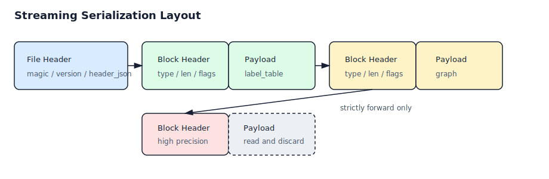

# VSAG 完全流式序列化方案 Proposal

## 背景

当前 VSAG 的 all-in-one 序列化格式主要采用 footer-based 设计：正文先写出，元信息写在产物尾部。反序列化时需要先 seek 到尾部读取 footer，再回到正文开始位置加载索引。

这种设计无法满足以下场景：

- 写出目标是只能顺序追加的流，例如网络流、管道、对象存储 multipart 上传。
- 读取来源是只能顺序读取的流，例如 HTTP response body、pipe、非 seekable stream。
- 元信息必须位于序列化产物头部，以便加载前就能确定索引类型、构建参数、数据块能力和加载计划。
- 新旧版本之间需要可演进的 block 级兼容能力。
- 写出能力集合和加载能力集合可能不同，例如写出时包含高低精度，加载时只加载一种精度。

本 proposal 设计一套新的序列化格式。该格式不要求与现有 footer-based 格式互相兼容，但必须在自身格式版本内支持向前兼容和向后兼容。

## 目标

- 写出完全流式：只能顺序写，不允许 seek，不允许回填。
- 读取完全流式：只能顺序读，不允许 seek；允许顺序空读并丢弃不需要的数据块。
- 元信息位于产物头部。
- 支持低版本代码读取高版本产物时自动跳过未知可选数据块。
- 支持高版本代码读取低版本产物时按写出时的参数快照恢复旧语义。
- 支持写出和加载时能力选择不一致。
- 新格式自洽即可，不要求兼容现有 `Serialize/Deserialize` 产物。

## 非目标

- 不改变现有 footer-based `Serialize/Deserialize` 的格式和行为。
- 不要求低版本代码支持高版本新增的必需能力。
- 不要求被跳过的数据块之后还能被重新读取。
- 不要求第一阶段覆盖所有索引类型，DiskANN、IVF、ConjugateGraph 可以分阶段专项改造。

## 当前序列化问题总结

- `Footer::Parse(StreamReader&)` 依赖 `Length()`、`PushSeek()`、`PopSeek()` 从尾部读取 metadata。
- `InnerIndexInterface::Deserialize(std::istream&)` 顶层会先调用 `Footer::Parse` 判断空索引。
- `StreamReader` 当前抽象强制暴露 `Seek()`。
- 部分索引正文也有随机访问逻辑：
  - IVF 用 datacell offsets 和 `PushSeek + Slice` 读取块。
  - DiskANN 用 `seekg(datacell_offset)` 读取分段。
  - ConjugateGraph 内部先 seek 到 footer，再 seek 回正文。
  - HGraph 某些兼容路径通过读 magic 失败后 seek 回退。

因此，新格式不能只是把 footer 移到 header，还需要把正文组织成可顺序跳过的 block stream。

## 总体设计

新格式采用 header-first + TLV block stream 结构。

```text
[file_magic]
[format_major]
[format_minor]
[header_length]
[header_json]
[header_checksum]

repeat until EOF:
  [block_magic]
  [block_type]
  [block_version]
  [block_flags]
  [block_length]
  [block_payload_checksum]
  [block_payload]
```

其中 TLV 表示：

- Type：数据块类型，例如 `label_table`、`base_codes`、`high_precision_codes`。
- Length：payload 字节长度，用于顺序读取或顺序丢弃。
- Value：具体数据块内容。

## 格式示意图



## Header 设计

Header 必须只包含加载 body 前必须知道的信息。它必须稳定演进，新增字段只能追加，旧代码应忽略未知字段。

示例：

```json
{
  "format": "vsag_stream_v1",
  "format_major": 1,
  "format_minor": 0,
  "index_name": "hgraph",
  "writer_version": "0.16.0",
  "build_param_snapshot": "{...}",
  "basic_info": {
    "dim": 128,
    "metric": "l2",
    "max_capacity": 1000000,
    "use_reorder": true
  },
  "required_blocks": [
    "label_table",
    "base_codes",
    "graph"
  ],
  "optional_blocks": [
    "low_precision_codes",
    "high_precision_codes",
    "raw_vector",
    "attribute_filter"
  ],
  "block_manifest": [
    {
      "type": "label_table",
      "version": 1,
      "required": true
    },
    {
      "type": "low_precision_codes",
      "version": 1,
      "required": false,
      "capability": "low_precision"
    },
    {
      "type": "high_precision_codes",
      "version": 1,
      "required": false,
      "capability": "high_precision"
    }
  ]
}
```

### Header 字段原则

- `format_major` 不兼容时直接失败。
- `format_minor` 可用于同一 major 内的兼容扩展。
- `build_param_snapshot` 保存写出时完整构建参数，避免高版本用新默认值误读低版本索引。
- `basic_info` 保存加载前必须知道的基础信息。
- `required_blocks` 中的未知块不能跳过成功，必须报错。
- `optional_blocks` 中的未知块可以顺序空读丢弃。
- `block_manifest` 不保存 offset；offset 与完全流式目标冲突。

## Block Header 设计

建议二进制字段：

```cpp
struct StreamBlockHeader {
    char magic[8];
    uint32_t type_id;
    uint32_t version;
    uint64_t flags;
    uint64_t length;
    uint32_t payload_checksum;
};
```

`type_id` 和字符串 block type 的映射由代码版本维护。为了便于诊断，可以在 header manifest 中保存字符串名称。

### Block 长度

完全流式写出不能写完 payload 后回填长度，因此每个 block 在写 block header 前必须知道 payload size。

可选实现方式：

- 优先使用已有 `CalcSerializeSize()`。
- 对没有可靠 size 计算的模块，先用 counting writer 干跑一次。
- counting writer 只能计数，不能产生外部写入。
- 禁止通过 seek 回填 block length。

## 兼容性设计

## 低版本代码读取高版本产物

低版本代码读取高版本产物时：

- 如果 `format_major` 不支持，直接失败。
- 如果 `format_major` 支持但出现未知 header 字段，忽略。
- 如果出现未知 block：
  - 若该 block 在 header 中是 optional，按 `block_length` 顺序读取并丢弃。
  - 若该 block 是 required，返回不支持错误。
- 如果出现已知 block 的更高 `block_version`：
  - 若该 block version 声明兼容旧 reader，可按旧 reader 解析公共前缀并丢弃剩余 payload。
  - 否则按未知 block 规则处理。

顺序空读未知块不算 seek，因为读指针始终向前移动。

## 高版本代码读取低版本产物

高版本代码读取低版本产物时：

- 使用 header 中的 `build_param_snapshot` 恢复写出时参数语义。
- 对低版本不存在的新能力 block，按旧版本语义补默认状态。
- 只能补语义等价的默认值。
- 如果用户加载参数要求某个低版本不存在的能力，应报错或按显式 fallback 策略降级。

示例：

- 低版本没有 `raw_vector` block，高版本加载时如果用户要求 `load_raw_vector=true`，应失败或明确 fallback。
- 低版本没有 `source_id_table`，高版本不得假装其存在，只能按旧 label 语义加载。

## Block Version 策略

每个 block 独立演进版本。

- 新增可选能力：新增 optional block。
- 新增必需能力：新增 required block 或提升 `format_major`。
- 扩展已有 block：优先保持前缀兼容，新增字段放在 payload 尾部。
- 删除字段：不建议在同一 major 内删除；可以废弃但保留解析。

## 能力选择设计

写出时和加载时的能力集合可以不同。

示例：写出时同时包含高低精度，加载时只加载低精度。

```text
writer options:
  write_low_precision = true
  write_high_precision = true

reader options:
  load_low_precision = true
  load_high_precision = false
```

读取时在 body 开始前生成 `LoadPlan`：

- 必须读取的 block。
- 可以读取的 block。
- 应该跳过的 block。
- 缺失时可以用默认语义补齐的 block。
- 缺失时必须报错的 block。

## 能力选择流程图


## 读写选项

建议新增独立选项结构：

```cpp
struct StreamSerializeOptions {
    bool write_low_precision = true;
    bool write_high_precision = true;
    bool write_raw_vector = true;
    bool write_attribute_filter = true;
    bool write_extra_info = true;
};

struct StreamDeserializeOptions {
    bool load_low_precision = true;
    bool load_high_precision = true;
    bool load_raw_vector = false;
    bool load_attribute_filter = true;
    bool load_extra_info = true;
};
```

后续可以替换为 capability bitset，避免 bool 字段无限增长。

## API 建议

在 `include/vsag/index.h` 新增独立 API，不改变现有接口：

```cpp
virtual tl::expected<void, Error>
SerializeStreaming(std::ostream& out_stream,
                   const StreamSerializeOptions& options) const;

virtual tl::expected<void, Error>
DeserializeStreaming(std::istream& in_stream,
                     const StreamDeserializeOptions& options);
```

内部建议增加：

```cpp
virtual JsonType
CollectStreamingHeader(const StreamSerializeOptions& options) const;

virtual void
SerializeStreamingBody(ForwardStreamWriter& writer,
                       const StreamSerializeOptions& options) const;

virtual void
DeserializeStreamingBody(ForwardStreamReader& reader,
                         const JsonType& header,
                         const StreamDeserializeOptions& options);
```

## 写出流程

1. 根据索引状态和 `StreamSerializeOptions` 收集 header metadata。
2. 生成 block manifest。
3. 写 file header。
4. 按稳定顺序写 block。
5. 每个 block 写出前先确定 payload length。
6. 写 block header。
7. 写 block payload。
8. 写出完成后不追加 footer，不做 seek，不做回填。

伪代码：

```cpp
auto header = index.CollectStreamingHeader(options);
StreamHeader::Write(writer, header);

for (const auto& block : BuildWritePlan(header, options)) {
    auto length = block.CalcSerializeSize();
    StreamBlockHeader::Write(writer, block.type, block.version, block.flags, length);
    block.SerializePayload(writer);
}
```

## 读取流程

1. 顺序读取 file header。
2. 校验 magic、major version、header checksum。
3. 从 header 恢复构建期参数快照。
4. 根据 `StreamDeserializeOptions` 生成 `LoadPlan`。
5. 顺序读取每个 block header。
6. 若 block 支持且需要，反序列化 payload。
7. 若 block 不支持或不需要，按 `block_length` 顺序读取并丢弃。
8. 到 EOF 后检查所有 required block 是否满足。
9. 初始化派生状态，例如内存统计、location map、mutex/pool 等。

伪代码：

```cpp
auto header = StreamHeader::Read(reader);
auto plan = BuildLoadPlan(header, options);

while (reader.HasMore()) {
    auto block_header = StreamBlockHeader::Read(reader);
    if (plan.ShouldDeserialize(block_header)) {
        DeserializeBlockPayload(reader, block_header, plan);
        plan.MarkLoaded(block_header.type);
    } else {
        reader.Discard(block_header.length);
        plan.MarkSkipped(block_header.type);
    }
}

plan.CheckRequiredBlocks();
```

## Block 依赖与能力

每个索引类型需要定义自己的 block DAG，但写出顺序必须线性稳定。

HGraph 示例：

```text
required:
  label_table
  base_codes
  bottom_graph
  route_graphs

optional:
  high_precision_codes
  extra_info
  attribute_filter
  raw_vector
  source_id_table
```

能力选择约束：

- 如果加载 `high_precision_codes`，必须存在支撑搜索所需的 graph 和 label table。
- 如果跳过 `raw_vector`，相关 `GetDataByIdsWithFlag(DATA_FLAG_FLOAT32_VECTOR)` 应返回不支持或缺失错误。
- 如果跳过 `attribute_filter`，带 attribute filter 的搜索应报错或显式退化。
- 如果跳过 `extra_info`，`GetExtraInfoById` 应报错或返回缺失。

## 对现有索引的迁移建议

## 第一阶段

实现 storage 层基础能力：

- `ForwardStreamReader`：只支持 `Read`、`GetCursor`、`Discard`。
- `ForwardStreamWriter`：只支持追加 `Write`、`GetCursor`。
- `StreamHeader`。
- `StreamBlockHeader`。
- `CountingStreamWriter`。
- 非 seekable stream 测试工具。

选择一个最简单索引做端到端闭环，建议 `BruteForce` 或 `WARP`。

## 第二阶段

支持 HGraph：

- 抽取 `CollectStreamingHeader`。
- 把现有正文拆成稳定 block。
- 新流式路径禁止使用旧格式兼容探测逻辑。
- `source_id_table` 是否存在由 header/block manifest 显式描述，不再读失败后 seek 回退。

## 第三阶段

支持 Pyramid、SINDI。

这些索引当前正文基本顺序，主要工作是 block 边界和 metadata 前置。

## 第四阶段

专项处理 IVF：

- 用顺序 block 替代 datacell offsets。
- 按固定顺序读取 bucket、partition_strategy、label_table、reorder_codes、attr_filter_index。
- 不再使用 `PushSeek + Slice`。

## 第五阶段

评估 DiskANN 和 ConjugateGraph：

- DiskANN 当前依赖 offset 构造 layout reader，需要重新设计懒加载策略。
- ConjugateGraph 当前内部 footer 需要改为 header-first 或纳入外层 block metadata。

## 错误处理

建议错误类型：

- magic 不匹配：`INVALID_BINARY`。
- major version 不支持：`UNSUPPORTED_INDEX_OPERATION` 或新增 `UNSUPPORTED_SERIALIZATION_VERSION`。
- header checksum 错误：`READ_ERROR` 或 `INVALID_BINARY`。
- required block 缺失：`READ_ERROR`。
- required block 未知：`UNSUPPORTED_INDEX_OPERATION`。
- 用户请求能力缺失：`INVALID_ARGUMENT`。
- payload checksum 错误：`READ_ERROR`。

## 测试计划

必须新增非 seek 测试，防止误走旧路径。

- `NonSeekableIStream`：调用 `seekg/tellg` 直接失败。
- `AppendOnlyOStream`：调用 `seekp/tellp` 直接失败或记录错误。
- 空索引流式写读。
- 非空索引流式写读，搜索结果一致。
- 写出高低精度，加载低精度 only。
- 写出高低精度，加载高精度 only。
- 低版本 reader 跳过高版本 optional block。
- 低版本 reader 遇到高版本 required block 失败。
- 高版本 reader 读取低版本缺失 optional block，按旧语义补默认。
- 截断 header 失败。
- 截断 block payload 失败。
- checksum 错误失败。

## 文档计划

更新：

- `docs/docs/zh/src/advanced/serialization.md`
- `docs/docs/en/src/advanced/serialization.md`

文档中明确两套格式：

- 旧格式：footer-based，可能 seek，兼容现有产物。
- 新格式：header-first + TLV block stream，完全顺序读写，不兼容旧产物。

## 关键约束

- 新格式入口不得调用 `Footer::Parse`。
- 新格式 reader 不应继承必须实现 `Seek` 的旧 `StreamReader`，除非可以在编译或测试中保证不会调用。
- block payload 长度必须在写 block header 前确定。
- block manifest 不保存 offset。
- 加载能力选择必须在读取 body 前确定。
- 跳过 block 只能顺序读取并丢弃，不能 seek。

## 总结

该方案通过 header-first + TLV block stream 实现完全流式读写。Header 提供加载前决策所需的参数快照、基础信息和 block manifest；body 由可顺序跳过的数据块组成，从而支持版本演进、未知 optional block 跳过、required block 检查，以及写出能力和加载能力不一致的场景。

推荐先以 `BruteForce/WARP` 完成最小闭环，再扩展到 `HGraph`，最后处理 IVF、DiskANN、ConjugateGraph 等当前正文存在随机访问假设的索引。
