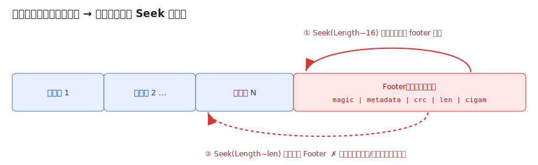
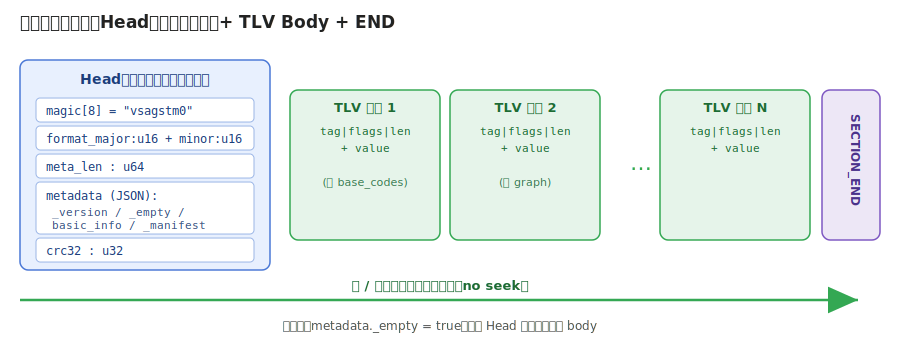
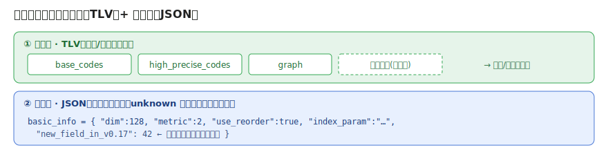
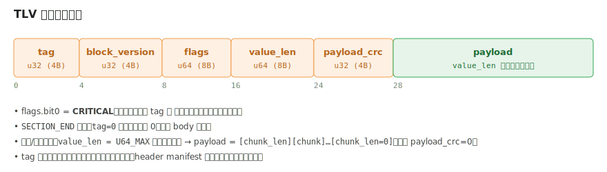
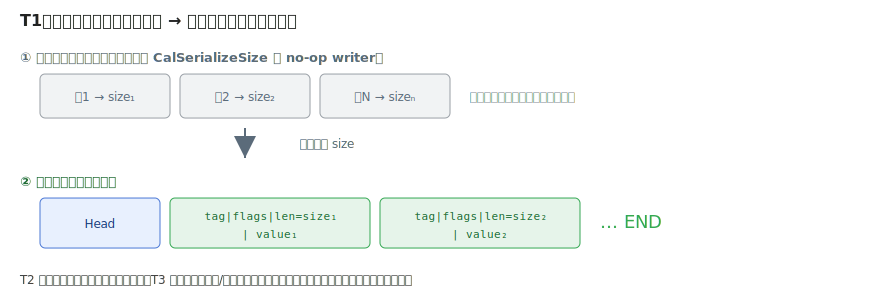
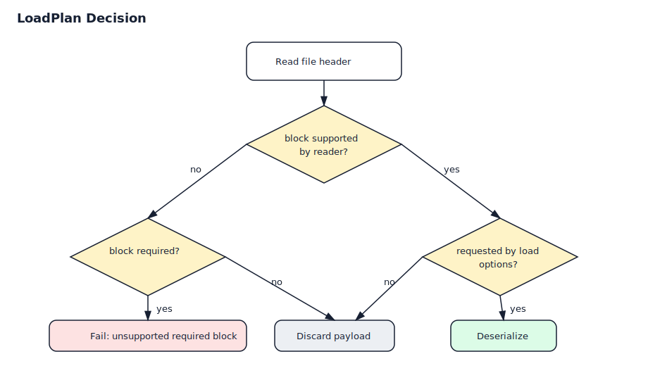
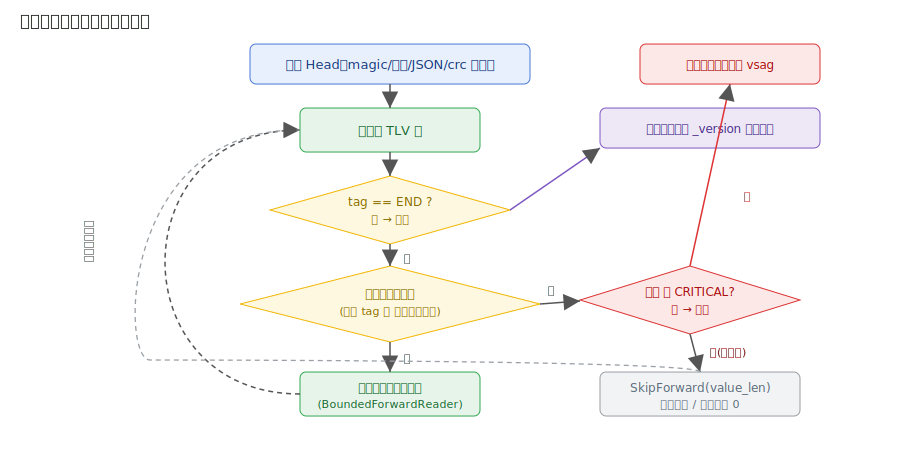
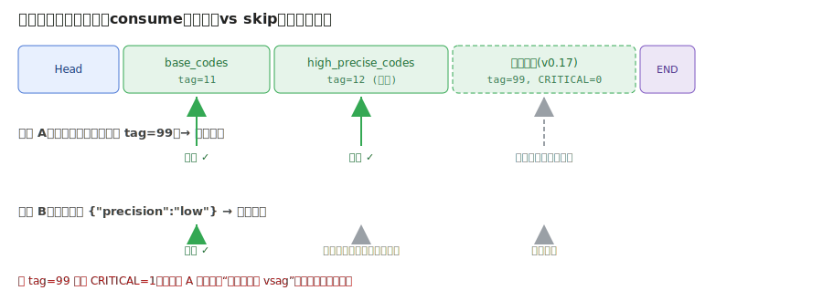

# VSAG 流式序列化方案（Streaming Serialization Proposal）

> Status: Draft / Proposal
> Scope: 在 VSAG 中**新增**一套完全流式的序列化/反序列化格式与 API，与既有
> footer-based 格式**并存、不互转**。

---

## 1. TL;DR

新增一套 **header-first + TLV block stream** 序列化格式：

1. **写出完全流式**：全程只向前写，无 `seek`，无回填。
2. **读取完全流式**：全程只向前读，无 `seek`；允许前向空读丢弃（read-discard）不需要的块。
3. **元信息在头部**：索引类型、构建参数快照、block 清单等全部位于产物开头，加载前即可制定加载计划。
4. **前向兼容（低读高）**：每个 block 自带长度，低版本代码可顺序跳过未知的可选块；遇到未知必需块则明确报错。
5. **后向兼容（高读低）**：高版本代码按 header 中的参数快照恢复旧语义，缺失块按低版本默认值补齐。
6. **三类入口分工清晰**：`serialize` 只负责把内存索引全量写成字节流；
   `deserialize` 只负责从字节流全量还原内存索引；`load` 才负责版本兼容、能力选择、
   以及内存/磁盘态混合加载。

核心手段：头部 `StreamHeader` 承载全部语义元信息；body 采用
**TLV（Tag–Length–Value）自描述分段**。`Length` 让"无 seek 前向跳过"成为可能，
从而用同一套机制支撑 `deserialize` 的完整恢复，以及 `load` 的版本兼容与能力选择。

---

## 2. 背景：为什么现有格式不是"流式"

现有 all-in-one 序列化采用 footer-based 设计：正文先写出，元信息（`Footer`）
写在产物尾部。反序列化时必须先 seek 到尾部读 footer，再回到正文开始位置加载。



具体阻碍（已核对源码）：

- `Footer::Parse(StreamReader&)`（`src/storage/serialization.cpp:48`）依赖
  `reader.Length()` + `PushSeek()/PopSeek()` 从尾部读取 metadata。
- 顶层入口 `InnerIndexInterface::Deserialize(std::istream&)`
  （`src/algorithm/inner_index_interface.cpp:270`）第一步就调用 `Footer::Parse`
  判断空索引，强制要求流可 seek、可量长度。
- `IOStreamReader` 构造函数本身就要 `seekg` 到流尾量长度
  （`src/storage/stream_reader.cpp:95`），不可用于不可 seek 的流。
- 部分索引正文也存在随机访问假设：
  - **IVF** 在新版格式中用 datacell sizes + `Slice` 分段读取
    （`src/algorithm/ivf/ivf.cpp:614`），旧 v0.14 路径反而是纯顺序的
    （`ivf.cpp:626`）。
  - **DiskANN** 用 `seekg(datacell_offset)` 读取分段，并依赖 offset 做按需随机 IO。
  - **ConjugateGraph** 内部自带 footer，需要头尾跳转。
  - **HGraph** 的 body 本就是纯顺序读，唯一非流式点只是开头的 `Footer::Parse`，
    以及个别"读 magic 失败后 seek 回退"的兼容探测路径。

值得注意的是，**写端 `StreamWriter`（`src/storage/stream_writer.h:26`）本就没有
seek 接口**，真正的障碍集中在"元信息在尾部"和"读端随机访问"两点。

这种设计无法满足以下场景：

- 写出目标是只能顺序追加的流：网络流、管道、对象存储 multipart 上传。
- 读取来源是只能顺序读取的流：HTTP response body、pipe、非 seekable stream。
- 元信息必须位于头部，以便加载前确定索引类型、构建参数和加载计划。
- 新旧版本之间需要 block 级的可演进兼容能力。
- 写出能力集合与加载能力集合不一致（如写出含高低精度、加载只取一种）。

> 结论：新格式不能只是"把 footer 搬到头部"，还必须把 body 改造成
> **可顺序读取、可顺序跳过**的自描述分段。

---

## 3. 目标与非目标

### 目标

| # | 目标 | 落地手段 |
| --- | --- | --- |
| G1 | 写端无 seek | 只向前 `Write`，block 长度先于写出而知，禁止回填 |
| G2 | 元信息在头部 | 语义元信息全部进 `StreamHeader`；body 自描述 |
| G3 | 读端无 seek | 新增禁 seek 顺序读 reader；跳过用前向 read-discard |
| G4 | 前向兼容（低读高） | TLV 自带 `Length` + `CRITICAL` 标志位决定跳过或报错 |
| G5 | 后向兼容（高读低） | tag 驱动派发；缺块/缺字段按 header 参数快照补默认 |
| G6 | `serialize` / `deserialize` / `load` 职责拆分 | 前两者无参数全量读写；`load` 参数生成 LoadPlan，决定立即加载、延迟加载或跳过 |
| G7 | 独立自洽 | 独立 magic；与旧格式并存、不互转、不兼容旧产物 |
| G8 | 遵循仓库规范 | 公共 API 在 `include/vsag/`、实现在 `src/`、`vsag` 命名空间；优先 `uint64_t`；clang-format/tidy 15；单测覆盖率 ≥ 90% |

### 非目标

- 不改变现有 footer-based `Serialize/Deserialize` 的格式和行为。
- 不要求低版本代码支持高版本新增的**必需**能力。
- 不要求被跳过的数据块之后还能被重新读取。
- 不要求第一阶段覆盖所有索引类型；DiskANN、IVF、ConjugateGraph 分阶段专项改造。
- 不处理跨字节序/跨架构问题（沿用既有 `WriteObj/ReadObj` 的原生字节序假设，与现状一致）。

---

## 4. 总体设计：Header-first + TLV Block Stream

整体布局：所有语义元信息集中在头部 `StreamHeader`，其后是一串 TLV block，
最后以 `SECTION_END` 哨兵收尾（不依赖 EOF，便于嵌入更大的文件或多索引拼接场景）。



```text
[magic "vsagstm0"]            8 bytes
[format_major]                u16
[format_minor]                u16
[meta_len]                    u64
[metadata JSON]               meta_len bytes
[meta_checksum]               u32 (CRC32, 覆盖 metadata 字节)

repeat:
  [tag]                       u32   block 类型
  [block_version]             u32   block 独立版本
  [flags]                     u64   bit0 = CRITICAL
  [value_len]                 u64   payload 字节数（U64_MAX 表示分块编码，见 §6）
  [payload_checksum]          u32   CRC32, 覆盖 payload（分块编码时置 0）
  [payload]                   value_len bytes

[SECTION_END]                 tag = 0 的空 block，标志 body 结束
```

### 为什么是 TLV

需求 G4（低读高时跳过未知块）与 G6（加载只取一种能力）的本质都是
"**跳过一个块**"。在"无 seek、纯前向"前提下跳过一个块，唯一办法是
**该块自带长度**，读端据此做前向 read-discard——这正是 TLV。

> 设计取舍：曾考虑"纯顺序、分段不带长度"的简化方案，但它无法跳过不认识或
> 不需要的块（不知道字节数就无法前向空读），在引入 G4/G6 后被否决。

业界同构先例：**PNG chunk**（`length + type + data + crc`，并用标志位区分
critical / ancillary）、**Matroska EBML**、**RIFF/WAV**、**Protobuf**
（未知字段可跳过）。

由此获得**两层可扩展性**：



- **分段级（TLV）**：增删/跳过整块（某 datacell、某精度、某能力）。
  靠 `tag + value_len + flags.CRITICAL`。
- **字段级（JSON / 块内追加）**：增删标量参数。靠 JSON 的"未知键忽略、缺键默认"，
  以及块内新字段只追加到 payload 尾部 + 有界读自动跳过未读尾部。

---

## 5. 字节布局细节

### 5.1 TLV 记录



```cpp
struct StreamBlockHeader {
    uint32_t tag;               // block 类型，注册表统一分配，只增不复用
    uint32_t block_version;     // 该 block 独立演进的版本号
    uint64_t flags;             // bit0 = CRITICAL，其余保留
    uint64_t value_len;         // payload 长度；U64_MAX 表示分块编码（见 §6）
    uint32_t payload_checksum;  // CRC32(payload)；分块编码时置 0
};
```

- `tag` 数值与字符串名称的映射由代码内的**注册表**维护（新增
  `src/storage/serialization_tags.h`：数值 enum + 默认 CRITICAL 属性 +
  引入版本注释，**只增不复用**）。为便于诊断，header metadata 的 manifest
  中同时保存字符串名称。
- `flags.CRITICAL = 1`：读端不认识该 tag 时必须报错；`= 0`：可前向跳过。
- `SECTION_END`：`tag = 0` 的空记录，标志 body 结束。读端遇到它才算正常结束，
  靠 EOF 结束视为截断错误。

### 5.2 Header metadata（JSON）

Header 只包含**加载 body 前必须知道**的信息，新增字段只能追加，旧代码忽略未知键。

```json
{
  "format": "vsag_stream_v1",
  "index_name": "hgraph",
  "writer_version": "0.16.0",
  "_version": 1,
  "_min_reader_version": 1,
  "_empty": false,
  "build_param_snapshot": "{...完整构建参数...}",
  "basic_info": {
    "dim": 128,
    "metric": "l2",
    "max_capacity": 1000000,
    "use_reorder": true
  },
  "block_manifest": [
    { "tag": 1, "name": "label_table",          "version": 1, "critical": true  },
    { "tag": 2, "name": "base_codes",           "version": 1, "critical": true  },
    { "tag": 3, "name": "bottom_graph",         "version": 1, "critical": true  },
    { "tag": 4, "name": "route_graphs",         "version": 1, "critical": true  },
    { "tag": 5, "name": "high_precision_codes", "version": 1, "critical": false,
      "capability": "high_precision" },
    { "tag": 6, "name": "raw_vector",           "version": 1, "critical": false,
      "capability": "raw_vector" }
  ]
}
```

字段原则：

- `format_major` 不兼容时直接失败；`format_minor` 用于同一 major 内的兼容扩展。
- `_version` 驱动后向兼容的默认值语义；`_min_reader_version` 是可选的全局闸门。
- `_empty` 标记空索引：读端在 header 阶段即可识别空索引并提前完成初始化，
  无需依赖 body（对应旧格式中 `Footer::Parse` 的空索引判断职责）。
- `build_param_snapshot` 保存写出时的**完整构建参数**，避免高版本用新默认值
  误读低版本索引（标量参数的缺键判定可复用既有 `Contains()` 模式，先例见
  `src/algorithm/ivf/ivf.cpp:655`）。
- `basic_info` 保存加载前必须知道的基础信息。
- `block_manifest` 声明产物包含的全部 block 及其 critical 属性，供读端在
  body 开始前生成 LoadPlan；**不保存 offset**——offset 与完全流式目标冲突。
- CRITICAL 的最终裁决以**块内 flags** 为准，manifest 中的 `critical` 仅用于
  预生成 LoadPlan 与诊断（两者由写端保证一致）。

---

## 6. 写端：无 seek 下如何确定 Length

TLV 要求"先写 Length 再写 Value"，而无 seek 写端不能回填，故每块长度必须
**先于写出而知**。三种实现（可混用），推荐 **T1**：



| 方案 | 机制 | 额外内存 | 额外 CPU | 适用 |
| --- | --- | --- | --- | --- |
| **T1 测量预扫描（推荐）** | 先用 counting writer（只计数、不产生外部写入）跑一遍 body 记录每块尺寸，再真正写出。复用既有 `CalSerializeSize` 模式（`src/algorithm/inner_index_interface.cpp:291`） | 0 | 约 2×（多为 memcpy，非热点） | 尺寸可测的内存索引（HGraph/IVF/…） |
| **T2 逐段缓冲** | 每块先写入可增长内存 buffer 得到长度，再写 `[header][bytes]` | 单块峰值 | 1× | 段不大、或序列化逻辑不便重复执行 |
| **T3 分块编码（`value_len = U64_MAX`）** | payload 写成 `[chunk_len:u32][chunk]…[chunk_len=0]`，无需预知总长；跳过时按 chunk 读到 0 | 单 chunk | 1× | 超大段或尺寸天然不可测 |

写出流程：

1. 根据索引状态收集 header metadata、生成 block manifest。`serialize` 不接受能力裁剪参数，
   对内存中已具备的可序列化能力做全量写出。
2. 写 file header（magic、版本、metadata、checksum）。
3. 按**稳定线性顺序**逐块写出：先确定 payload 长度，再写 block header，再写 payload。
4. 写 `SECTION_END`。全程不追加 footer、不 seek、不回填。

```cpp
auto header = index.CollectStreamingHeader();
StreamHeader::Write(writer, header);

for (const auto& block : BuildWritePlan(header)) {
    uint64_t length = block.MeasurePayloadSize();   // T1/T2，或 U64_MAX 走 T3
    StreamBlockHeader::Write(writer, block.tag, block.version, block.flags, length);
    block.SerializePayload(writer);
}
StreamBlockHeader::WriteSectionEnd(writer);
```

---

## 7. 读端：Deserialize / Load + TLV 驱动循环

新格式有两个读入口，二者共享 header-first + TLV 机制，但职责不同：

- `deserialize`：无参数、全量恢复。输入是一个完整字节流，输出语义等价的内存态索引。
  它不做能力裁剪，不决定哪些块进内存/磁盘，也不承载高低版本兼容策略；若产物无法被
  当前版本完整理解，应明确报错。
- `load`：有参数、策略化加载。它是版本前后向兼容、能力选择、内存/磁盘态混合加载的
  唯一入口。`load` 可把某些块立即载入内存，把某些块绑定为 reader 延迟加载，也可按
  用户策略跳过可选能力。

### 7.1 LoadPlan

`load` 解析 header 后、读 body 前，结合 `block_manifest` 与 `StreamLoadOptions`
生成 `LoadPlan`，对每个 tag 预先归类：

- 必须立即加载到内存的块（critical 且本版本支持）。
- 按加载参数需要立即加载到内存的块。
- 按加载参数需要保留 reader、搜索时延迟读取的块。
- 应当跳过的块（用户明确不需要的能力、未知的非 critical 块）。
- 缺失时可按旧语义补默认的块。
- 缺失或未知时必须报错的块（critical）。



### 7.2 读循环



```cpp
auto header = StreamHeader::Read(reader);          // 顺序读，校验 magic/version/crc
auto plan = BuildLoadPlan(header, load_options);   // body 开始前确定

while (true) {
    auto bh = StreamBlockHeader::Read(reader);
    if (bh.tag == SECTION_END) break;
    if (plan.ShouldLoadToMemory(bh)) {
        BoundedForwardReader bounded(reader, bh.value_len);
        LoadBlockPayloadToMemory(bounded, bh);
        bounded.SkipRemaining();                   // 跳过块内未读尾部（段内前向兼容）
        plan.MarkLoaded(bh.tag);
    } else if (plan.ShouldBindReader(bh)) {
        auto bounded_source = reader.BindForwardPayload(bh.value_len);
        BindBlockReader(bounded_source, bh);        // 例如高精度 codes 搜索时再读
        plan.MarkBound(bh.tag);
    } else if (!bh.IsCritical() || plan.ExplicitlySkipped(bh.tag)) {
        reader.Discard(bh.value_len);              // 前向 read-discard，不是 seek
        plan.MarkSkipped(bh.tag);
    } else {
        throw VsagException(...);                  // 未知 critical 块
    }
}
plan.CheckRequiredBlocks();                        // 所有 critical 块均已加载或绑定
// 初始化派生状态：内存统计、location map、mutex/pool 等
```

关键组件语义：

- `BoundedForwardReader`：把子反序列化器限制在本块 `value_len` 内（可复用现有
  单参 `Slice(length)` 的边界检查思想，`src/storage/stream_reader.cpp:37`，
  但实现不得依赖 seek），块读完后把未读尾部前向丢弃 → 块内新字段追加到尾部时
  **旧读者自动跳过**，实现段内前向兼容。
- `Discard(n)`：循环 `Read` 进固定小缓冲并丢弃。读指针始终向前，**不算 seek**。

---

## 8. 兼容性设计

### 8.1 前向兼容：低版本代码读高版本产物

- `format_major` 不支持 → 直接失败。
- header 中出现未知 JSON 键 → 忽略。
- 出现未知 tag 的块：
  - `CRITICAL = 0` → 按 `value_len` 前向丢弃，继续。
  - `CRITICAL = 1` → 返回不支持错误。
- 出现已知 tag 但更高 `block_version` 的块：
  - 若该版本声明前缀兼容 → 按旧 reader 解析公共前缀，`BoundedForwardReader`
    丢弃剩余 payload。
  - 否则按未知块规则处理（看 CRITICAL）。

### 8.2 后向兼容：高版本代码读低版本产物

读取是 tag 驱动的：低版本没写的块，其 tag 根本不会出现。读完后高版本对
"期望但缺失"的块/字段处理规则：

- 用 header 的 `build_param_snapshot` 与 `_version` 恢复写出时的参数语义。
- 缺失的可选能力块 → 按旧版本语义补**语义等价**的默认状态。
- 高版本**不得假装**缺失数据存在。例如低版本没有 `raw_vector` 块，加载后
  `GetDataByIds` 类接口应返回能力缺失错误，而不是伪造数据。
- 如果用户 `load` 参数显式要求某个低版本产物中不存在的能力
  （如 `raw_vector` 必须立即加载）→ 报错，或按用户显式指定的 fallback 策略降级。

### 8.3 同一套"跳过"机制

前向兼容（被动跳过未知块）与 `load` 能力选择（主动跳过不需要的块）复用**同一条**
TLV 前向跳过路径，差别只在 `LoadPlan` 判定来源：



### 8.4 Block version 演进策略

- 新增**可选**能力 → 新增 `CRITICAL = 0` 的新 tag。
- 新增**必需**能力 → 新增 `CRITICAL = 1` 的新 tag，或提升 `format_major`。
- 扩展已有块 → 新字段只追加到 payload 尾部，保持前缀兼容，`block_version` +1。
- 删除字段 → 同一 major 内不删除；可废弃但保留解析。
- tag 数值只增不复用；注册表 review 严格把关 CRITICAL 标注
  （错标"可忽略"会让低版本静默丢失关键数据）。

---

## 9. Load：兼容、能力选择与内存/磁盘态加载

`serialize` 与 `deserialize` 都是无参数的全量字节流转换：

- `serialize`：把当前内存中的索引对象完整写出。它不接受“写哪些/不写哪些”的参数，
  也不负责能力裁剪。
- `deserialize`：从字节流完整还原一个内存态索引。它不接受“读哪些/不读哪些”的参数，
  也不负责内存/磁盘态策略。

真正需要策略的入口是 `load`。能力以独立 block 承载，`load` 参数决定每个能力的加载形态：

```cpp
enum class StreamLoadTarget {
    SKIP,          // 明确不加载该能力，仅适用于可选能力
    MEMORY,        // 立即加载到内存
    READER,        // 绑定 reader，运行时按需读取
};

struct StreamLoadOptions {
    StreamLoadTarget low_precision_codes{StreamLoadTarget::MEMORY};
    StreamLoadTarget high_precision_codes{StreamLoadTarget::READER};
    StreamLoadTarget raw_vector{StreamLoadTarget::SKIP};
    StreamLoadTarget attribute_filter{StreamLoadTarget::MEMORY};
    StreamLoadTarget extra_info{StreamLoadTarget::MEMORY};
};
```

后续可演进为 capability bitset 或 JSON `load_params`，例如
`{"load": {"high_precision_codes": "reader", "raw_vector": "skip"}}`，避免 bool 字段无限增长。

典型 HGraph 场景：构建时索引同时包含 basic codes 与 high precision codes；`serialize`
全量写出二者；`load` 时把 basic codes 加载到内存，把 high precision codes 绑定为 reader，
搜索过程中真正发生精排数据访问时再通过 reader 读取相应数据。

**索引侧依赖约束**：被跳过能力对应的查询路径必须可降配，且降配行为有明确语义。
VSAG 已有可复用的开关：

- HGraph：`has_precise_reorder()` / `ignore_reorder_`
  （`src/algorithm/hgraph/hgraph.h:385`、`:495`）；低精度
  `basic_flatten_codes_`（`:487`）、高精度 `high_precise_codes_`（`:488`）。
- IVF：`use_reorder_` / `reorder_codes_`（`src/algorithm/ivf/ivf.cpp:260`）。

行为约定示例（HGraph）：

- 将 `high_precision_codes` 设为 `READER` 时，支撑搜索的 graph、label_table 与 basic codes
  必须已加载到内存（由 critical 块和 LoadPlan 保证）。
- 跳过 `raw_vector` → `GetDataByIdsWithFlag(DATA_FLAG_FLOAT32_VECTOR)`
  返回能力缺失错误。
- 跳过 `attribute_filter` → 带属性过滤的搜索报错，或按显式策略退化为不过滤。
- 跳过 `extra_info` → `GetExtraInfoById` 返回缺失错误。

---

## 10. 组件与对外 API

### 新增/改造组件

| 组件 | 文件 | 说明 |
| --- | --- | --- |
| 常量 | `include/vsag/constants.h`、`src/constants.cpp` | `SERIAL_STREAM_MAGIC = "vsagstm0"`、`SERIAL_STREAM_VERSION`、`SECTION_END = 0` |
| tag 注册表 | 新增 `src/storage/serialization_tags.h` | 数值 enum + 默认 CRITICAL + 引入版本注释，只增不复用 |
| `StreamHeader` | `src/storage/serialization.{h,cpp}` | `Write` 顺序写头；`Read` 顺序读头（**禁** `Length/Seek`）；复用 `Metadata` + CRC |
| 顺序读 reader | `src/storage/stream_reader.{h,cpp}` | `ForwardStreamReader`：仅前向 `Read/GetCursor/Discard`，调用 `Seek/Length` 抛异常；构造期不量长度 |
| 有界前向读 | 同上 | `BoundedForwardReader` + `SkipForward(reader, len)` |
| counting writer | `src/storage/stream_writer.{h,cpp}` | `CountingStreamWriter`：只计数不写出，供 T1 预扫描 |
| TLV helper | 新增 `src/storage/tlv_section.{h,cpp}` | 写/读 block header、CRITICAL 处理、skip、分块编码 |
| 编排 | `src/algorithm/inner_index_interface.{h,cpp}` | 新增 `SerializeStreaming/DeserializeStreaming/LoadStreaming` 编排；**新增独立的 body 虚接口**，与旧路径隔离，回归风险最低 |

> 实现注意（已核对源码）：`BufferStreamReader` 在 `max_size = UINT64_MAX` 时
> 会触发 `reader->Length()`（`src/storage/stream_reader.cpp:171`），装饰流式
> 源时必须传显式上界；`IOStreamReader` 构造即 seek 量长度（`:95`），不可用于
> 不可 seek 的流——这正是必须新增 `ForwardStreamReader` 的原因。

### 对外 API（不改既有签名）

```cpp
// include/vsag/index.h，经 IndexImpl SAFE_CALL 透传
virtual tl::expected<void, Error>
SerializeStreaming(std::ostream& out_stream) const;

virtual tl::expected<void, Error>
DeserializeStreaming(std::istream& in_stream);

virtual tl::expected<void, Error>
LoadStreaming(std::istream& in_stream,
              const StreamLoadOptions& options = {});

// 回调/流式信道版：复用既有 WriteFuncType（include/vsag/index.h:64），
// 新增只前向读的 ReadFuncType
virtual tl::expected<void, Error>
SerializeStreaming(WriteFuncType write_func) const;

virtual tl::expected<void, Error>
DeserializeStreaming(ReadFuncType read_func);

virtual tl::expected<void, Error>
LoadStreaming(ReadFuncType read_func,
              const StreamLoadOptions& options = {});
```

内部建议接口：

```cpp
virtual JsonType
CollectStreamingHeader() const;

virtual void
SerializeStreamingBody(StreamWriter& writer) const;

virtual void
DeserializeStreamingBody(ForwardStreamReader& reader,
                         const JsonType& header);

virtual void
LoadStreamingBody(ForwardStreamReader& reader,
                  const JsonType& header,
                  const StreamLoadOptions& options);
```

---

## 11. 各索引适配与分阶段计划

| 索引 | 现状 | 改造内容 | 难度 |
| --- | --- | --- | --- |
| BruteForce / WARP | body 顺序自终止 | 接入 Head + TLV，body 逻辑几乎不变 | 低 |
| HGraph | body 已顺序，仅头部 `Footer::Parse` 非流式 | 元信息移头部；各 datacell 分配 tag；`source_id_table` 等的存在性由 manifest 显式声明，**禁止**"读 magic 失败后 seek 回退"的探测逻辑 | 低 |
| SINDI / Pyramid / Sparse | body 基本顺序 | 同上，主要工作是 block 边界与 metadata 前置 | 低 |
| IVF | 新格式用 datacell sizes + `Slice` 随机读 | 改为顺序 TLV 读：bucket → partition_strategy → label_table → reorder_codes → attr_filter_index 固定顺序（可参考旧 v0.14 顺序路径 `ivf.cpp:626`） | 中 |
| ConjugateGraph | 内部自带 footer，头尾跳转 | 改为可选 TLV 块（`CRITICAL = 0`），元信息纳入外层 header | 中 |
| DiskANN | offset + seek + 按需随机 IO | 与"无 seek 读"天然冲突；首版**仅支持单流整体加载**，按需随机 IO 不在本方案范围 | 中-高 |

里程碑：

- **M0** 设计确认：wire format、tag 注册表、API 命名、DiskANN 范围、T1/T3 选型。
- **M1** 基础设施：常量、`serialization_tags.h`、`StreamHeader`、
  `ForwardStreamReader`、`BoundedForwardReader`、`CountingStreamWriter`、
  TLV helper、非 seekable 测试工具（含单测）。
- **M2** 接口编排 + 公共 API（`serialize` / `deserialize` 无参数，`load` 含
  options/`load_params`）；以 BruteForce 或
  WARP 打通最小端到端闭环。
- **M3** HGraph 打通（端到端 + 前/后向兼容 + 禁 seek 测试）。
- **M4** `load` 能力选择样例：高/低精度分块 + 内存/reader 混合加载。
- **M5** 扩展索引：SINDI / Pyramid / Sparse → IVF。
- **M6** ConjugateGraph + DiskANN（单流整体加载）。
- **M7** 文档（`docs/docs/{en,zh}/src/` 序列化章节）+ 覆盖率收尾。

---

## 12. 错误处理

| 场景 | 错误类型 |
| --- | --- |
| magic 不匹配 | `INVALID_BINARY` |
| `format_major` 不支持 | `UNSUPPORTED_INDEX_OPERATION`（或新增 `UNSUPPORTED_SERIALIZATION_VERSION`） |
| header checksum 错误 | `INVALID_BINARY` |
| payload checksum 错误 | `READ_ERROR` |
| 未知 critical 块 | `UNSUPPORTED_INDEX_OPERATION` |
| critical 块缺失（读完未见） | `READ_ERROR` |
| 用户 `load` 请求的能力在产物中缺失 | `INVALID_ARGUMENT` |
| 流截断（header / payload / 缺 `SECTION_END`） | `READ_ERROR` |

---

## 13. 测试计划（C++ 覆盖率 ≥ 90%）

必须新增**非 seek 强约束**测试，防止实现悄悄走旧路径：

1. **机制层禁 seek**：`NoSeekStreamReader` 替身，任何
   `Seek/Length/PushSeek` 调用即测试失败；包裹完整反序列化流程验证。
2. **不可 seek 信道端到端**：自定义不可 `seekg` 的 `streambuf`（`NonSeekableIStream`）
   与不可 `seekp` 的 `AppendOnlyOStream`，走公共 API 全流程。
3. **头部定位**：断言产物 offset 0 起 8 字节 == `vsagstm0`。
4. **round-trip**：各索引 build → 序列化 → 反序列化 → 搜索结果一致
   （含空索引、reorder、attr filter、各 data_type/metric）。
5. **前向兼容**：注入未知 `CRITICAL = 0` 块 → 跳过且结果正确；
   注入 `CRITICAL = 1` 块 → 报错。
6. **后向兼容**：构造缺块/缺字段产物 → 按 `_version` 与参数快照补默认，
   行为与低版本一致。
7. **Load 策略**：写高+低精度，`load` 时 basic 进内存、high precision 绑定 reader；
   搜索按需读取 high precision；请求缺失能力 → `INVALID_ARGUMENT`。
8. **分块编码（T3）**：写读 + 跳过路径。
9. **破坏性**：篡改 magic / 版本 / crc / `value_len`、截断 header、
   截断 payload、缺 `SECTION_END` → 对应错误类型。
10. 工具链回归：`make fmt`、`make lint`（clang-tidy 15）、`make test`、`make cov`。

---

## 14. 文档计划

更新官网文档（canonical 位置）：

- `docs/docs/zh/src/` 序列化章节
- `docs/docs/en/src/` 序列化章节

文档中明确两套格式并存：

- 旧格式：footer-based，读取可能 seek，兼容全部现有产物。
- 新格式：header-first + TLV block stream，完全顺序读写，**不兼容**旧产物；
  `serialize` / `deserialize` 适用于全量流式信道，`load` 适用于兼容与能力选择场景。

---

## 15. 风险与边界

1. **DiskANN 按需随机 IO vs 无 seek 读**：天然冲突，首版仅单流整体加载，
   懒加载策略需另行设计。
2. **T1 双趟幂等性**：内存索引的序列化天然幂等；若某组件序列化过程有副作用
   或从流读取，必须改用 T3。
3. **CRITICAL 错标**：错标为"可忽略"会让低版本静默丢失关键数据 →
   注册表变更必须严格 review。
4. **块内新字段必须追加到 payload 尾部**：否则段内前向兼容失效；
   需在 coding standards 中明文约束。
5. **CRC 覆盖范围**：header metadata 与每块 payload 均有 CRC；
   分块编码（T3）块的整体 CRC 置 0，完整性退化为传输层保证
   （后续可为每个 chunk 加 CRC）。
6. **能力降配自洽**：被跳过能力的查询路径必须可降配且行为有测试覆盖。
7. **字节序/对齐**：沿用原生字节序假设，不支持跨架构搬运（与现状一致）。
8. **EOF/截断健壮性**：纯前向读必须对流提前结束健壮处理；
   正常结束以 `SECTION_END` 为准，依赖 EOF 结束视为错误。

---

## 16. 关键约束清单（实现 checklist）

- [ ] 新格式入口不得调用 `Footer::Parse`。
- [ ] 新格式 reader 不暴露可用的 `Seek/Length`；调用即抛异常。
- [ ] block payload 长度必须在写 block header 前确定（T1/T2），或显式走 T3。
- [ ] 禁止 seek 回填任何长度字段。
- [ ] `block_manifest` 不保存 offset。
- [ ] LoadPlan 必须在读取 body 前确定。
- [ ] 跳过 block 只能前向 read-discard。
- [ ] tag 只增不复用；CRITICAL 变更需 review。
- [ ] 块内新增字段只追加到 payload 尾部。
- [ ] 提交遵循仓库规范：Conventional Commits、人类 `Signed-off-by:` 在前、
      紧随 `Assisted-by:`（无空行）；PR 带 `kind/feature` + `version/*` 标签并
      用 `Fixes/Closes/Resolves #N` 关联 issue。

---

## 17. 总结

> 尾部 `Footer` → **头部 `StreamHeader`**；body → **TLV 自描述分段** +
> `SECTION_END` 哨兵。`serialize` 全量写出内存索引，`deserialize` 全量恢复内存索引，
> `load` 负责高低版本兼容、能力选择以及内存/reader 混合加载。`tag` 标识块、
> `value_len` 支撑"无 seek 前向跳过"、`flags.CRITICAL` 区分可忽略/必须报错、
> header 参数快照驱动后向默认。
> 写端用 T1 测量预扫描（或 T3 分块编码）在无 seek 下取得长度，
> `load` 读端用 LoadPlan + 有界前向读全程不 seek。
> 落地顺序：BruteForce/WARP 最小闭环 → HGraph → 其余顺序索引 → IVF →
> ConjugateGraph / DiskANN。
